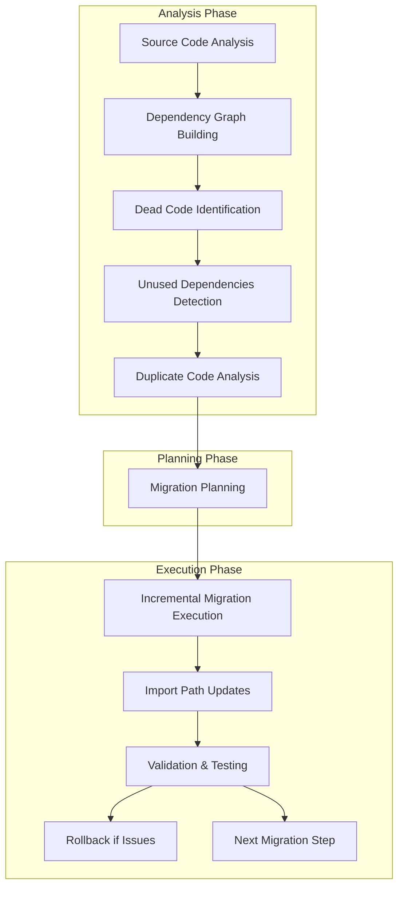
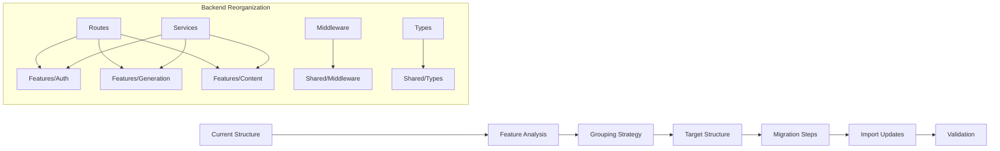

# Design Document

## Overview

This design outlines a comprehensive approach to cleaning up and reorganizing the backend codebase while preserving all existing functionality. The current architecture consists of a React/Vite frontend, Node.js/TypeScript Express backend, and Python Lambda functions, all integrated with AWS services.

The cleanup will focus on three main areas: dead code removal, unused dependency elimination, and feature-based reorganization. The approach prioritizes incremental changes with validation checkpoints to ensure the working frontend remains unaffected.

## Architecture

### Current Architecture Analysis

The application follows a multi-tier architecture:

1. **Frontend (React/Vite)**: Feature-based organization with 11 pages, 9 component directories, and 11 library directories
2. **Backend (Node.js/Express)**: Layer-based organization with routes, services, middleware, and types
3. **Lambda Functions (Python)**: Function-based organization with generate_concepts and query_concepts handlers
4. **AWS Services**: DynamoDB, Bedrock, Cognito, S3, Secrets Manager

### Target Architecture

The reorganized architecture will maintain the same multi-tier structure but with improved organization:

1. **Frontend**: Enhanced feature-based organization (already well-structured)
2. **Backend**: Migrated to feature-based organization matching frontend patterns
3. **Lambda Functions**: Consolidated and cleaned up with shared utilities
4. **Shared Components**: Common utilities and types extracted to shared directories

## Components and Interfaces

### Dead Code Analysis Engine

```typescript
interface DeadCodeAnalyzer {
  analyzeFiles(rootPath: string): Promise<AnalysisResult>;
  buildDependencyGraph(files: FileInfo[]): DependencyGraph;
  identifyUnusedCode(graph: DependencyGraph): UnusedCodeReport;
  validateRemoval(files: string[]): Promise<ValidationResult>;
}

interface AnalysisResult {
  totalFiles: number;
  referencedFiles: string[];
  unreferencedFiles: string[];
  circularDependencies: CircularDependency[];
  duplicateCode: DuplicateCodeBlock[];
}
```

### Dependency Management System

```typescript
interface DependencyManager {
  analyzeDependencies(packageJsonPath: string): Promise<DependencyAnalysis>;
  identifyUnusedPackages(analysis: DependencyAnalysis): UnusedPackage[];
  validateRemoval(packages: string[]): Promise<RemovalValidation>;
  updatePackageJson(packages: string[], action: 'remove' | 'update'): Promise<void>;
}

interface DependencyAnalysis {
  declared: Package[];
  imported: Package[];
  unused: Package[];
  outdated: Package[];
  duplicates: DuplicatePackage[];
}
```

### File Migration System

```typescript
interface FileMigrator {
  planMigration(sourceStructure: FileStructure, targetStructure: FileStructure): MigrationPlan;
  executeStep(step: MigrationStep): Promise<MigrationResult>;
  updateImports(movedFiles: MovedFile[]): Promise<ImportUpdateResult>;
  validateMigration(plan: MigrationPlan): Promise<ValidationResult>;
}

interface MigrationPlan {
  steps: MigrationStep[];
  rollbackPlan: RollbackStep[];
  estimatedDuration: number;
  riskLevel: 'low' | 'medium' | 'high';
}
```

### Code Consolidation Engine

```typescript
interface CodeConsolidator {
  identifyDuplicates(files: string[]): Promise<DuplicateGroup[]>;
  extractSharedUtility(duplicates: DuplicateGroup): SharedUtility;
  refactorReferences(utility: SharedUtility): Promise<RefactorResult>;
  validateConsolidation(result: RefactorResult): Promise<ValidationResult>;
}

interface DuplicateGroup {
  pattern: string;
  files: string[];
  similarity: number;
  extractionComplexity: 'simple' | 'moderate' | 'complex';
}
```

## Data Models

### File Analysis Models

```typescript
interface FileInfo {
  path: string;
  type: 'typescript' | 'javascript' | 'python' | 'json' | 'other';
  size: number;
  lastModified: Date;
  imports: ImportStatement[];
  exports: ExportStatement[];
  functions: FunctionInfo[];
  classes: ClassInfo[];
  variables: VariableInfo[];
}

interface ImportStatement {
  source: string;
  imports: string[];
  type: 'default' | 'named' | 'namespace' | 'side-effect';
  isExternal: boolean;
}

interface ExportStatement {
  name: string;
  type: 'default' | 'named';
  isReExport: boolean;
  source?: string;
}
```

### Migration Models

```typescript
interface MigrationStep {
  id: string;
  type: 'move' | 'rename' | 'delete' | 'create' | 'update';
  source?: string;
  target?: string;
  dependencies: string[];
  rollbackAction: RollbackAction;
}

interface MovedFile {
  oldPath: string;
  newPath: string;
  updatedImports: ImportUpdate[];
}

interface ImportUpdate {
  file: string;
  oldImport: string;
  newImport: string;
  line: number;
}
```

### Feature Organization Models

```typescript
interface FeatureStructure {
  name: string;
  path: string;
  components: ComponentInfo[];
  services: ServiceInfo[];
  types: TypeInfo[];
  utils: UtilityInfo[];
  tests: TestInfo[];
}

interface ComponentInfo {
  name: string;
  path: string;
  dependencies: string[];
  exports: string[];
  isShared: boolean;
}
```

## Data Flow Diagrams





## Correctness Properties

*A property is a characteristic or behavior that should hold true across all valid executions of a system—essentially, a formal statement about what the system should do. Properties serve as the bridge between human-readable specifications and machine-verifiable correctness guarantees.*

<function_calls>
<invoke name="prework">
<parameter name="featureName">backend-cleanup-reorganization