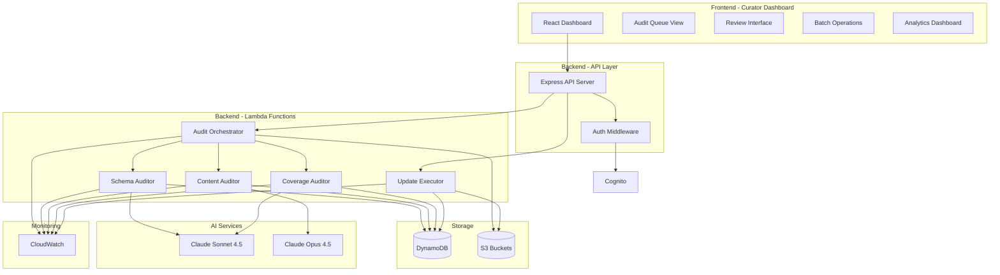

# Design Document: Content Lifecycle Management System

## Overview

The Content Lifecycle Management (CLM) system provides surgical content updates for Sensa AI's educational platform. Instead of regenerating entire courses when issues are detected, the system performs AI-powered audits to identify specific problems and enables curators to approve targeted fixes through an intuitive dashboard.

The system achieves 70-90% cost reduction compared to full regeneration by preserving valid content and updating only what needs fixing. It maintains content quality through version control, audit trails, and a multi-tier approval workflow.

### Key Design Principles

1. **Surgical Precision**: Update only what needs fixing, preserve everything else
2. **Human-in-the-Loop**: AI proposes, humans approve (with smart auto-approval for high-confidence changes)
3. **Audit Trail**: Every change is tracked, versioned, and reversible
4. **Cost Optimization**: Use appropriate AI models (Sonnet for schema, Opus for deep analysis)
5. **Integration First**: Leverage existing AWS infrastructure (DynamoDB, S3, Cognito, CloudWatch)

## Architecture

### System Components



### Technology Stack

**Frontend:**
- React 18+ with TypeScript
- React Router for navigation
- TanStack Query for data fetching
- Diff viewer library (react-diff-viewer-continued)
- Recharts for analytics visualization

**Backend:**
- Express.js API server (existing)
- AWS Lambda functions (Node.js 20.x runtime)
- AWS SDK v3 for service integration

**Storage:**
- DynamoDB for audit jobs, findings, versions, and change logs
- S3 for full audit reports and content snapshots

**AI Services:**
- Anthropic Claude API (Sonnet 4.5 and Opus 4.5)

**Infrastructure:**
- AWS Cognito for authentication
- AWS CloudWatch for logging and monitoring
- AWS EventBridge for scheduled audits

## Components and Interfaces

### Frontend Components

#### 1. Curator Dashboard Route (`/curator`)

Protected route requiring curator role. Main entry point for CLM system.

```typescript
interface CuratorDashboardProps {
  user: AuthenticatedUser;
}

interface CuratorDashboardState {
  activeView: 'queue' | 'analytics' | 'history';
  filters: AuditFilters;
}
```

#### 2. Audit Queue View

Displays pending audits with filtering and sorting capabilities.

```typescript
interface AuditQueueViewProps {
  filters: AuditFilters;
  onFilterChange: (filters: AuditFilters) => void;
  onAuditSelect: (auditId: string) => void;
}

interface AuditFilters {
  subject?: string;
  auditType?: AuditType[];
  severity?: Severity[];
  status?: AuditStatus[];
  dateRange?: { start: Date; end: Date };
}

interface AuditQueueItem {
  id: string;
  subject: string;
  auditType: AuditType;
  status: AuditStatus;
  findingCount: number;
  highSeverityCount: number;
  createdAt: string;
  estimatedReviewMinutes: number;
}
```

#### 3. Audit Detail View

Deep dive into a specific audit with diff visualization.

```typescript
interface AuditDetailViewProps {
  auditId: string;
  onApprove: (findingIds: string[]) => Promise<void>;
  onReject: (findingIds: string[], reason: string) => Promise<void>;
  onEdit: (findingId: string, newProposal: ProposedChange) => Promise<void>;
}

interface AuditDetailData {
  audit: AuditJob;
  findings: AuditFinding[];
  affectedConcepts: LearningConcept[];
}
```

#### 4. Diff Viewer Component

Side-by-side comparison with syntax highlighting.

```typescript
interface DiffViewerProps {
  oldValue: any;
  newValue: any;
  viewType: 'split' | 'unified';
  language?: 'json' | 'text';
  highlightChanges: boolean;
}
```

#### 5. Batch Review Interface

Multi-select approval with safety checks.

```typescript
interface BatchReviewProps {
  findings: AuditFinding[];
  selectedIds: string[];
  onSelectionChange: (ids: string[]) => void;
  onBatchApprove: () => Promise<void>;
  onBatchReject: (reason: string) => Promise<void>;
}

interface BatchOperationSummary {
  totalSelected: number;
  highSeverityCount: number;
  estimatedImpact: string;
  requiresConfirmation: boolean;
}
```

#### 6. Analytics Dashboard

Content health metrics and trends.

```typescript
interface AnalyticsDashboardProps {
  timeRange: 'week' | 'month' | 'quarter' | 'year';
}

interface ContentHealthMetrics {
  overallScore: number; // 0-100
  schemaCompliance: number; // percentage
  auditCoverage: number; // percentage
  issuesByType: Record<IssueType, number>;
  costSavings: {
    totalSaved: number;
    vsFullRegeneration: number;
  };
  trendsOverTime: {
    date: string;
    healthScore: number;
    issuesResolved: number;
  }[];
}
```

### Backend API Endpoints

#### Audit Management

```typescript
// GET /api/curator/audits
// Query params: subject, type, status, page, limit
interface GetAuditsResponse {
  audits: AuditQueueItem[];
  total: number;
  page: number;
  limit: number;
}

// GET /api/curator/audits/:auditId
interface GetAuditDetailResponse {
  audit: AuditJob;
  findings: AuditFinding[];
  concepts: LearningConcept[];
}

// POST /api/curator/audits/trigger
interface TriggerAuditRequest {
  subject: string;
  auditType: AuditType;
  scope?: {
    conceptIds?: string[];
    examObjectives?: string[];
  };
  priority: 'low' | 'medium' | 'high';
}

interface TriggerAuditResponse {
  auditId: string;
  status: 'queued' | 'running';
  estimatedCompletionTime: string;
}
```

#### Finding Management

```typescript
// POST /api/curator/findings/approve
interface ApproveFindingsRequest {
  findingIds: string[];
  curatorId: string;
  notes?: string;
}

interface ApproveFindingsResponse {
  approved: string[];
  failed: { findingId: string; error: string }[];
  executionJobId: string;
}

// POST /api/curator/findings/reject
interface RejectFindingsRequest {
  findingIds: string[];
  curatorId: string;
  reason: string;
}

// PUT /api/curator/findings/:findingId
interface UpdateFindingRequest {
  proposedChange: ProposedChange;
  curatorNotes: string;
}
```

#### Analytics

```typescript
// GET /api/curator/analytics
interface GetAnalyticsResponse {
  metrics: ContentHealthMetrics;
  subjectBreakdown: Record<string, SubjectHealthMetrics>;
}

// GET /api/curator/analytics/history
interface GetHistoryResponse {
  changes: ChangeLogEntry[];
  total: number;
  page: number;
}
```

### Lambda Functions

#### 1. Audit Orchestrator Lambda

Manages audit lifecycle and coordinates auditor lambdas.

```typescript
interface AuditOrchestratorEvent {
  action: 'schedule' | 'trigger' | 'status';
  auditId?: string;
  config?: AuditConfig;
}

interface AuditConfig {
  subject: string;
  auditTypes: AuditType[];
  scope?: AuditScope;
  priority: 'low' | 'medium' | 'high';
}

interface AuditOrchestratorResponse {
  auditId: string;
  status: AuditStatus;
  progress?: {
    completed: number;
    total: number;
    currentPhase: string;
  };
}
```

**Responsibilities:**
- Create audit jobs in DynamoDB
- Invoke appropriate auditor lambdas
- Track progress and update status
- Send notifications on completion
- Handle retries and error recovery

#### 2. Schema Auditor Lambda

Validates schema compliance using Claude Sonnet 4.5.

```typescript
interface SchemaAuditorEvent {
  auditId: string;
  subject: string;
  conceptIds: string[];
  schemaVersion: string;
}

interface SchemaAuditorResponse {
  findings: AuditFinding[];
  summary: {
    totalConcepts: number;
    compliantConcepts: number;
    issuesFound: number;
  };
}
```

**Audit Checks:**
- Required fields present (tier, lifecyclePhase, dependencies, etc.)
- Field types match schema
- Enum values valid (tier, cognitiveLevel, lifecyclePhase)
- TRACES connections valid
- New schema fields missing (enrichment opportunities)

#### 3. Content Auditor Lambda

Deep content analysis using Claude Opus 4.5.

```typescript
interface ContentAuditorEvent {
  auditId: string;
  subject: string;
  conceptIds: string[];
  examObjectives: ExamObjective[];
}

interface ContentAuditorResponse {
  findings: AuditFinding[];
  summary: {
    totalConcepts: number;
    hallucinationsDetected: number;
    outdatedContent: number;
    qualityScore: number;
  };
}
```

**Audit Checks:**
- Factual accuracy against exam objectives
- Hallucination detection
- Template/placeholder content
- Content quality and clarity
- Example relevance and correctness

#### 4. Coverage Auditor Lambda

Analyzes exam objective coverage using Claude Sonnet 4.5.

```typescript
interface CoverageAuditorEvent {
  auditId: string;
  subject: string;
  examObjectives: ExamObjective[];
  existingConcepts: LearningConcept[];
}

interface CoverageAuditorResponse {
  findings: AuditFinding[];
  coverageMatrix: CoverageMatrix;
  summary: {
    totalObjectives: number;
    coveredObjectives: number;
    coveragePercentage: number;
    gapsIdentified: number;
  };
}

interface CoverageMatrix {
  objectives: {
    id: string;
    name: string;
    weight: number;
    coveredBy: string[]; // concept IDs
    coverageDepth: 'none' | 'shallow' | 'adequate' | 'comprehensive';
  }[];
}
```

#### 5. Update Executor Lambda

Applies approved changes with version control.

```typescript
interface UpdateExecutorEvent {
  executionJobId: string;
  approvedFindings: string[];
  curatorId: string;
}

interface UpdateExecutorResponse {
  success: boolean;
  applied: string[];
  failed: { findingId: string; error: string }[];
  versionsCreated: string[];
}
```

**Operations:**
- Create version snapshots before changes
- Apply changes atomically per concept
- Update TRACES connections
- Log all changes to audit trail
- Rollback on failure

## Data Models

### DynamoDB Tables

#### Table: `clm-audits`

Stores audit jobs and their findings.

```typescript
interface AuditJobRecord {
  // Primary Key
  pk: string; // "AUDIT#{auditId}"
  sk: string; // "METADATA"
  
  // Audit metadata
  auditId: string;
  subject: string;
  auditType: AuditType;
  status: AuditStatus;
  priority: 'low' | 'medium' | 'high';
  
  // Scope
  conceptIds?: string[];
  examObjectives?: string[];
  
  // Execution
  triggeredBy: 'schedule' | 'curator' | 'system';
  curatorId?: string;
  startedAt: string;
  completedAt?: string;
  
  // Results
  findingCount: number;
  highSeverityCount: number;
  s3ReportKey?: string;
  
  // Timestamps
  createdAt: string;
  updatedAt: string;
  ttl?: number; // Auto-delete after 90 days
}

interface AuditFindingRecord {
  // Primary Key
  pk: string; // "AUDIT#{auditId}"
  sk: string; // "FINDING#{findingId}"
  
  // Finding metadata
  findingId: string;
  auditId: string;
  
  // Issue details
  issueType: IssueType;
  severity: Severity;
  conceptId: string;
  conceptName: string;
  
  // Proposed fix
  operation: OperationType;
  currentValue: any;
  proposedValue: any;
  fieldPath?: string; // e.g., "shape.simpleCore"
  
  // AI analysis
  confidenceScore: number; // 0-100
  reasoning: string;
  
  // Approval workflow
  status: FindingStatus;
  approvedBy?: string;
  rejectedBy?: string;
  rejectionReason?: string;
  approvedAt?: string;
  
  // Timestamps
  createdAt: string;
  updatedAt: string;
}

type AuditType = 'schema' | 'content' | 'coverage' | 'quality';
type AuditStatus = 'queued' | 'running' | 'completed' | 'failed' | 'cancelled';
type IssueType = 
  | 'missing-field'
  | 'invalid-field'
  | 'deprecated-field'
  | 'hallucination'
  | 'outdated-content'
  | 'template-content'
  | 'weak-connection'
  | 'coverage-gap'
  | 'validation-error';
type Severity = 'low' | 'medium' | 'high' | 'critical';
type OperationType = 'INSERT' | 'UPDATE' | 'DELETE' | 'RELINK' | 'ENRICH';
type FindingStatus = 'pending' | 'approved' | 'rejected' | 'applied' | 'failed';
```

**Access Patterns:**
1. Get audit by ID: `pk = AUDIT#{auditId} AND sk = METADATA`
2. Get findings for audit: `pk = AUDIT#{auditId} AND sk BEGINS_WITH FINDING#`
3. List audits by subject (GSI): `GSI1PK = SUBJECT#{subject}, GSI1SK = createdAt`
4. List pending findings (GSI): `GSI2PK = STATUS#pending, GSI2SK = severity#createdAt`

#### Table: `clm-versions`

Stores versioned content snapshots.

```typescript
interface ContentVersionRecord {
  // Primary Key
  pk: string; // "CONCEPT#{conceptId}"
  sk: string; // "VERSION#{timestamp}"
  
  // Version metadata
  versionId: string;
  conceptId: string;
  versionNumber: number;
  
  // Content snapshot
  content: LearningConcept;
  
  // Version tracking
  schemaVersion: string;
  modelVersion: string; // e.g., "claude-opus-4.5"
  generationVersion: string;
  
  // Change context
  changeType: 'generation' | 'audit-fix' | 'manual-edit' | 'rollback';
  changeReason?: string;
  changedBy?: string;
  auditId?: string;
  findingId?: string;
  
  // Timestamps
  createdAt: string;
  ttl?: number; // Auto-delete after 30 days
}
```

**Access Patterns:**
1. Get latest version: `pk = CONCEPT#{conceptId}, sk = VERSION#{latest}`
2. Get version history: `pk = CONCEPT#{conceptId}, sk BEGINS_WITH VERSION#`
3. Get version by ID: `pk = CONCEPT#{conceptId}, sk = VERSION#{timestamp}`

#### Table: `clm-changelog`

Audit trail of all changes.

```typescript
interface ChangeLogRecord {
  // Primary Key
  pk: string; // "CHANGELOG#{date}" (YYYY-MM-DD)
  sk: string; // "{timestamp}#{conceptId}"
  
  // Change metadata
  changeId: string;
  conceptId: string;
  conceptName: string;
  subject: string;
  
  // Change details
  operation: OperationType;
  fieldPath?: string;
  oldValue?: any;
  newValue?: any;
  
  // Context
  auditId?: string;
  findingId?: string;
  changedBy: string;
  changeReason: string;
  
  // Version tracking
  previousVersionId: string;
  newVersionId: string;
  
  // Timestamps
  timestamp: string;
  ttl?: number; // Auto-delete after 90 days
}
```

**Access Patterns:**
1. Get changes by date: `pk = CHANGELOG#{date}`
2. Get changes for concept (GSI): `GSI1PK = CONCEPT#{conceptId}, GSI1SK = timestamp`
3. Get changes by curator (GSI): `GSI2PK = CURATOR#{curatorId}, GSI2SK = timestamp`

### S3 Buckets

#### Bucket: `sensa-clm-reports`

Stores full audit reports and diffs.

**Structure:**
```
/audits/{auditId}/
  report.json          # Full audit report
  findings.json        # All findings with details
  summary.json         # Executive summary
  
/diffs/{conceptId}/
  {versionId}-diff.json  # Detailed diff between versions
```

#### Bucket: `sensa-clm-snapshots`

Stores full content snapshots for rollback.

**Structure:**
```
/snapshots/{subject}/{date}/
  concepts.json        # All concepts at snapshot time
  metadata.json        # Snapshot metadata
```

## Data Models (Continued)

### TypeScript Interfaces

```typescript
interface ExamObjective {
  id: string;
  code: string; // e.g., "AZ-104.1.1"
  title: string;
  description: string;
  weight: number; // percentage
  difficulty: 'beginner' | 'intermediate' | 'advanced';
  keywords: string[];
}

interface ProposedChange {
  operation: OperationType;
  conceptId: string;
  fieldPath?: string;
  currentValue: any;
  proposedValue: any;
  reasoning: string;
}

interface AutoApprovalConfig {
  enabled: boolean;
  thresholds: {
    schema: number; // confidence score 0-100
    content: number;
    coverage: number;
    quality: number;
  };
  severityLimits: {
    autoApprove: Severity[]; // e.g., ['low']
    requireCurator: Severity[]; // e.g., ['medium']
    requireExpert: Severity[]; // e.g., ['high', 'critical']
  };
}
```


## Correctness Properties

A property is a characteristic or behavior that should hold true across all valid executions of a system—essentially, a formal statement about what the system should do. Properties serve as the bridge between human-readable specifications and machine-verifiable correctness guarantees.

### Property 1: Schema Issue Detection Completeness

*For any* concept with schema issues (missing fields, deprecated fields, or invalid values), the schema auditor should create an audit finding for each distinct issue.

**Validates: Requirements 1.2, 1.3, 1.4**

### Property 2: Schema Compliance Percentage Accuracy

*For any* set of concepts audited, the compliance percentage should equal (compliant concepts / total concepts) × 100.

**Validates: Requirements 1.5**

### Property 3: Coverage Gap Identification

*For any* exam objective without corresponding concepts, the coverage auditor should create a finding identifying the gap.

**Validates: Requirements 2.4, 4.2**

### Property 4: Confidence Score Presence

*For any* audit finding created, it should have a confidence score between 0 and 100.

**Validates: Requirements 2.5**

### Property 5: Placeholder Content Detection

*For any* concept containing placeholder patterns (TODO, [INSERT], TBD, etc.), the quality auditor should create a finding.

**Validates: Requirements 3.2**

### Property 6: Broken Connection Detection

*For any* TRACES connection referencing a non-existent concept ID, the quality auditor should create a finding.

**Validates: Requirements 3.3**

### Property 7: Validation Error Reporting

*For any* concept that fails validation rules, the finding should include the specific validation error message.

**Validates: Requirements 3.4**

### Property 8: Quality Score Assignment

*For any* concept processed by quality audit, it should be assigned a quality score between 0 and 100.

**Validates: Requirements 3.5**

### Property 9: Coverage Matrix Accuracy

*For any* coverage audit result, the coverage percentage for each objective should equal (covered concepts / required concepts) × 100.

**Validates: Requirements 4.4**

### Property 10: Coverage Gap Prioritization

*For any* set of coverage gaps, they should be ordered by (weight × difficulty_multiplier) in descending order.

**Validates: Requirements 4.5**

### Property 11: Audit Queue Filtering

*For any* filter criteria applied to the audit queue, only audits matching all selected criteria should be displayed.

**Validates: Requirements 5.2**

### Property 12: Audit Queue Sorting

*For any* sort criterion applied to the audit queue, audits should be ordered correctly by that criterion.

**Validates: Requirements 5.3**

### Property 13: Audit Metadata Completeness

*For any* audit displayed in the queue, it should include creation time, subject, finding count, and estimated review time.

**Validates: Requirements 5.4**

### Property 14: Diff Visualization Completeness

*For any* finding displayed, both current value and proposed value should be shown.

**Validates: Requirements 6.1**

### Property 15: Diff Color Coding

*For any* diff displayed, additions should be highlighted in green and deletions in red.

**Validates: Requirements 6.2**

### Property 16: Field-Level Diff Display

*For any* schema change finding, the diff should show old and new values for each changed field.

**Validates: Requirements 6.3**

### Property 17: Finding Context Completeness

*For any* finding displayed, it should include the reason for change and confidence score.

**Validates: Requirements 6.5**

### Property 18: Approval Action Availability

*For any* finding in pending status, approve, reject, and edit actions should be available.

**Validates: Requirements 7.1**

### Property 19: Approval Status Update

*For any* finding approved or rejected, its status should change to the corresponding state and be recorded with curator ID and timestamp.

**Validates: Requirements 7.2, 7.3**

### Property 20: Audit Completion Detection

*For any* audit where all findings have status 'approved', 'rejected', or 'applied', the audit status should be 'completed'.

**Validates: Requirements 7.5**

### Property 21: Batch Operation Atomicity

*For any* batch approval operation, either all changes should be applied successfully or all should be rolled back.

**Validates: Requirements 8.2, 16.2**

### Property 22: Batch Filtering Accuracy

*For any* batch filter criteria, only findings matching all criteria should be selectable.

**Validates: Requirements 8.4**

### Property 23: Batch Operation Summary Generation

*For any* completed batch operation, a summary should be generated including total processed, succeeded, and failed counts.

**Validates: Requirements 8.5**

### Property 24: INSERT Operation ID Preservation

*For any* INSERT operation, no existing concept IDs should be modified.

**Validates: Requirements 9.1**

### Property 25: UPDATE Operation Field Isolation

*For any* UPDATE operation specifying field paths, only those fields should be modified and all other fields should remain unchanged.

**Validates: Requirements 9.2**

### Property 26: DELETE Operation Reference Cleanup

*For any* concept deleted, all TRACES connections referencing it should be removed or updated.

**Validates: Requirements 9.3**

### Property 27: RELINK Operation Connection Validity

*For any* RELINK operation, all resulting TRACES connections should reference existing concept IDs.

**Validates: Requirements 9.4**

### Property 28: ENRICH Operation Field Addition

*For any* ENRICH operation, new fields should be added without modifying existing field values.

**Validates: Requirements 9.5**

### Property 29: Version Creation Before Modification

*For any* content modification, a version snapshot should be created with a timestamp before the current time.

**Validates: Requirements 10.1**

### Property 30: Change Log Completeness

*For any* change applied, a change log entry should be created with curator ID, timestamp, reason, and operation type.

**Validates: Requirements 10.2**

### Property 31: Version History Completeness

*For any* concept with modifications, requesting version history should return all versions ordered by timestamp descending.

**Validates: Requirements 10.3**

### Property 32: Rollback Restoration Accuracy

*For any* rollback operation, the concept should be restored to exactly match the selected version's content.

**Validates: Requirements 10.4**

### Property 33: Version Retention Duration

*For any* version created, it should not be deleted before 30 days from creation.

**Validates: Requirements 10.5**

### Property 34: Auto-Approval Routing

*For any* finding, its approval routing (auto, curator, expert) should be determined by its confidence score and severity according to configured thresholds.

**Validates: Requirements 11.1, 11.2, 11.3**

### Property 35: Auto-Approval Logging

*For any* auto-approved finding, a log entry should be created including confidence score and reasoning.

**Validates: Requirements 11.4**

### Property 36: Auto-Approval Configuration Persistence

*For any* auto-approval threshold configuration change, subsequent findings should be routed according to the new thresholds.

**Validates: Requirements 11.5**

### Property 37: Analytics Metric Calculation Accuracy

*For any* analytics query, all metrics (health scores, coverage percentages, cost savings) should be calculated correctly from source data.

**Validates: Requirements 12.1, 12.2, 12.3, 12.4, 12.5**

### Property 38: Audit Completion Notification

*For any* audit that completes, a notification should be sent to all curators with the finding summary.

**Validates: Requirements 13.2**

### Property 39: Audit Retry with Exponential Backoff

*For any* audit that fails, retry attempts should occur with exponentially increasing delays.

**Validates: Requirements 13.3, 19.1**

### Property 40: Audit Schedule Enforcement

*For any* configured audit schedule, audits should be triggered at the specified times for the specified subjects.

**Validates: Requirements 13.4**

### Property 41: Audit Overlap Prevention

*For any* subject with an audit in 'running' status, attempting to start another audit for the same subject should be prevented.

**Validates: Requirements 13.5**

### Property 42: On-Demand Audit Priority

*For any* on-demand audit and scheduled audit in the queue, the on-demand audit should be processed first.

**Validates: Requirements 14.2**

### Property 43: On-Demand Audit Notification

*For any* on-demand audit that completes, the requesting curator should receive an immediate notification.

**Validates: Requirements 14.3**

### Property 44: On-Demand Audit Scope Filtering

*For any* on-demand audit with concept or objective filters, only concepts matching the filters should be audited.

**Validates: Requirements 14.4**

### Property 45: On-Demand Audit Tracking

*For any* on-demand audit request, it should be logged with curator ID, timestamp, and scope.

**Validates: Requirements 14.5**

### Property 46: Role-Based Access Control

*For any* user without curator role, access to curator dashboard endpoints should be denied.

**Validates: Requirements 15.2**

### Property 47: Expert Action Authorization

*For any* expert-level action, the user should have expert role verified before execution.

**Validates: Requirements 15.3**

### Property 48: Authentication Event Logging

*For any* authentication or authorization event, a log entry should be created with user ID, action, and result.

**Validates: Requirements 15.4**

### Property 49: Session Timeout Enforcement

*For any* session older than 8 hours, subsequent requests should require re-authentication.

**Validates: Requirements 15.5**

### Property 50: Multi-Change Atomicity

*For any* concept with multiple approved changes, all changes should be applied in a single transaction.

**Validates: Requirements 16.1**

### Property 51: TRACES Connection Validation

*For any* TRACES connection update, both source and target concept IDs should exist before the update is applied.

**Validates: Requirements 16.3**

### Property 52: Delete Operation Atomicity

*For any* concept deletion, the concept removal and all TRACES reference updates should occur in the same transaction.

**Validates: Requirements 16.4**

### Property 53: Post-Update Schema Validation

*For any* update operation, the resulting concept should pass schema validation before the transaction commits.

**Validates: Requirements 16.5**

### Property 54: DynamoDB Naming Convention Compliance

*For any* DynamoDB table created by CLM, the table name should follow the pattern `clm-{resource-type}`.

**Validates: Requirements 17.1**

### Property 55: S3 Encryption Enforcement

*For any* object stored in CLM S3 buckets, server-side encryption should be enabled.

**Validates: Requirements 17.2**

### Property 56: CloudWatch Log Structure

*For any* log event sent to CloudWatch, it should be structured JSON with timestamp, level, and message fields.

**Validates: Requirements 17.3**

### Property 57: CloudWatch Metrics Publication

*For any* audit execution, metrics (duration, finding count, success/failure) should be published to CloudWatch.

**Validates: Requirements 17.5**

### Property 58: Pagination Implementation

*For any* audit queue query returning more than 100 items, results should be paginated with page tokens.

**Validates: Requirements 18.5**

### Property 59: Failure Rollback and Logging

*For any* change application failure, the system should rollback to the previous version and create an error log entry.

**Validates: Requirements 19.2**

### Property 60: Malformed Content Handling

*For any* malformed content encountered during audit, a finding should be created rather than failing the audit.

**Validates: Requirements 19.3**

### Property 61: Error Rate Alerting

*For any* time window where error rate exceeds 5% of operations, an alert should be sent to administrators.

**Validates: Requirements 19.5**

### Property 62: AI Model Selection by Audit Type

*For any* audit, the AI model used should match the audit type (Sonnet for schema/coverage, Opus for content/quality).

**Validates: Requirements 20.1, 20.2**

### Property 63: Audit Result Caching

*For any* audit request for the same subject and scope within 24 hours, cached results should be returned.

**Validates: Requirements 20.3**

### Property 64: API Request Batching

*For any* set of concepts to audit, API requests should be batched to maximize token efficiency.

**Validates: Requirements 20.4**

### Property 65: Cost Tracking Accuracy

*For any* audit execution, the cost should be tracked and included in analytics calculations.

**Validates: Requirements 20.5**

## Error Handling

### Error Categories

1. **Validation Errors**: Invalid input data, schema violations
2. **Authorization Errors**: Insufficient permissions, expired sessions
3. **External Service Errors**: AI API failures, AWS service unavailability
4. **Data Integrity Errors**: Concurrent modifications, referential integrity violations
5. **System Errors**: Unexpected exceptions, resource exhaustion

### Error Handling Strategies

#### Frontend Error Handling

```typescript
interface ErrorResponse {
  error: string;
  code: string;
  details?: any;
  retryable: boolean;
}

class CLMErrorHandler {
  handleError(error: ErrorResponse): void {
    switch (error.code) {
      case 'UNAUTHORIZED':
        // Redirect to login
        this.redirectToLogin();
        break;
      
      case 'FORBIDDEN':
        // Show permission denied message
        this.showPermissionDenied();
        break;
      
      case 'RATE_LIMIT':
        // Show retry with backoff
        this.showRetryMessage(error.details.retryAfter);
        break;
      
      case 'VALIDATION_ERROR':
        // Show validation errors inline
        this.showValidationErrors(error.details);
        break;
      
      case 'SERVICE_UNAVAILABLE':
        // Show service unavailable with retry
        this.showServiceUnavailable(error.retryable);
        break;
      
      default:
        // Show generic error
        this.showGenericError(error.error);
    }
  }
}
```

#### Backend Error Handling

```typescript
class AuditExecutionError extends Error {
  constructor(
    message: string,
    public readonly code: string,
    public readonly retryable: boolean,
    public readonly details?: any
  ) {
    super(message);
  }
}

async function executeAudit(config: AuditConfig): Promise<AuditResult> {
  try {
    // Execute audit
    return await performAudit(config);
  } catch (error) {
    if (error instanceof RateLimitError) {
      // Retry with exponential backoff
      return await retryWithBackoff(() => performAudit(config));
    }
    
    if (error instanceof ValidationError) {
      // Log and create finding for manual review
      await createManualReviewFinding(error);
      throw new AuditExecutionError(
        'Validation failed',
        'VALIDATION_ERROR',
        false,
        error.details
      );
    }
    
    if (error instanceof ServiceUnavailableError) {
      // Log and schedule retry
      await scheduleRetry(config);
      throw new AuditExecutionError(
        'Service unavailable',
        'SERVICE_UNAVAILABLE',
        true
      );
    }
    
    // Unknown error - log and alert
    await logError(error);
    await sendAlert('Unknown audit error', error);
    throw error;
  }
}
```

#### Transaction Rollback

```typescript
async function applyChanges(
  changes: ApprovedChange[]
): Promise<ApplyResult> {
  const transaction = await db.beginTransaction();
  const versionsCreated: string[] = [];
  
  try {
    for (const change of changes) {
      // Create version snapshot
      const version = await createVersion(change.conceptId, transaction);
      versionsCreated.push(version.id);
      
      // Apply change
      await applyChange(change, transaction);
      
      // Validate result
      await validateConcept(change.conceptId, transaction);
    }
    
    // Commit all changes
    await transaction.commit();
    
    return {
      success: true,
      applied: changes.map(c => c.id),
      versionsCreated
    };
  } catch (error) {
    // Rollback all changes
    await transaction.rollback();
    
    // Log failure
    await logChangeFailure(changes, error);
    
    return {
      success: false,
      error: error.message,
      rolledBack: changes.map(c => c.id)
    };
  }
}
```

### Retry Logic

```typescript
interface RetryConfig {
  maxAttempts: number;
  initialDelayMs: number;
  maxDelayMs: number;
  backoffMultiplier: number;
}

async function retryWithBackoff<T>(
  operation: () => Promise<T>,
  config: RetryConfig = {
    maxAttempts: 3,
    initialDelayMs: 1000,
    maxDelayMs: 30000,
    backoffMultiplier: 2
  }
): Promise<T> {
  let attempt = 0;
  let delay = config.initialDelayMs;
  
  while (attempt < config.maxAttempts) {
    try {
      return await operation();
    } catch (error) {
      attempt++;
      
      if (attempt >= config.maxAttempts) {
        throw error;
      }
      
      // Wait with exponential backoff
      await sleep(delay);
      delay = Math.min(delay * config.backoffMultiplier, config.maxDelayMs);
    }
  }
  
  throw new Error('Max retry attempts exceeded');
}
```

## Testing Strategy

### Dual Testing Approach

The CLM system requires both unit tests and property-based tests for comprehensive coverage:

- **Unit tests**: Verify specific examples, edge cases, and error conditions
- **Property tests**: Verify universal properties across all inputs

Both approaches are complementary and necessary. Unit tests catch concrete bugs in specific scenarios, while property tests verify general correctness across a wide range of inputs.

### Property-Based Testing Configuration

**Library Selection**: Use `fast-check` for TypeScript/JavaScript property-based testing.

**Test Configuration**:
- Minimum 100 iterations per property test (due to randomization)
- Each property test must reference its design document property
- Tag format: `Feature: content-lifecycle-management, Property {number}: {property_text}`

**Example Property Test**:

```typescript
import fc from 'fast-check';

// Feature: content-lifecycle-management, Property 25: UPDATE Operation Field Isolation
describe('UPDATE Operation Field Isolation', () => {
  it('should only modify specified fields', async () => {
    await fc.assert(
      fc.asyncProperty(
        conceptArbitrary(),
        fieldPathArbitrary(),
        fc.anything(),
        async (concept, fieldPath, newValue) => {
          // Create version snapshot
          const originalConcept = JSON.parse(JSON.stringify(concept));
          
          // Apply UPDATE operation
          const change: ProposedChange = {
            operation: 'UPDATE',
            conceptId: concept.id,
            fieldPath,
            currentValue: getFieldValue(concept, fieldPath),
            proposedValue: newValue,
            reasoning: 'Test update'
          };
          
          const result = await applyChange(change);
          const updatedConcept = await loadConcept(concept.id);
          
          // Verify only specified field changed
          const changedFields = findChangedFields(originalConcept, updatedConcept);
          expect(changedFields).toEqual([fieldPath]);
          
          // Verify specified field has new value
          expect(getFieldValue(updatedConcept, fieldPath)).toEqual(newValue);
        }
      ),
      { numRuns: 100 }
    );
  });
});
```

### Unit Testing Focus Areas

Unit tests should focus on:

1. **Specific Examples**: Concrete scenarios that demonstrate correct behavior
2. **Edge Cases**: Boundary conditions, empty inputs, maximum values
3. **Error Conditions**: Invalid inputs, missing data, constraint violations
4. **Integration Points**: API contracts, database operations, external service calls

**Example Unit Test**:

```typescript
describe('Audit Orchestrator', () => {
  it('should create audit job with correct metadata', async () => {
    const config: AuditConfig = {
      subject: 'AZ-104',
      auditTypes: ['schema', 'content'],
      priority: 'high'
    };
    
    const result = await orchestrator.createAudit(config);
    
    expect(result.auditId).toBeDefined();
    expect(result.status).toBe('queued');
    
    const audit = await db.getAudit(result.auditId);
    expect(audit.subject).toBe('AZ-104');
    expect(audit.auditType).toContain('schema');
    expect(audit.auditType).toContain('content');
    expect(audit.priority).toBe('high');
    expect(audit.triggeredBy).toBe('curator');
  });
  
  it('should prevent overlapping audits for same subject', async () => {
    const config: AuditConfig = {
      subject: 'AZ-104',
      auditTypes: ['schema'],
      priority: 'medium'
    };
    
    // Start first audit
    await orchestrator.createAudit(config);
    
    // Attempt second audit for same subject
    await expect(
      orchestrator.createAudit(config)
    ).rejects.toThrow('Audit already running for subject AZ-104');
  });
});
```

### Test Data Generators

Property tests require generators for complex data types:

```typescript
// Arbitrary for LearningConcept
function conceptArbitrary(): fc.Arbitrary<LearningConcept> {
  return fc.record({
    id: fc.uuid(),
    name: fc.string({ minLength: 1, maxLength: 100 }),
    stageId: fc.uuid(),
    order: fc.nat(),
    tier: fc.constantFrom('trunk', 'branch', 'leaf'),
    lifecyclePhase: fc.constantFrom('PREPARE', 'MODEL', 'DELIVER'),
    dependencies: fc.array(fc.uuid(), { maxLength: 5 }),
    outdegree: fc.nat({ max: 10 }),
    cognitiveLevel: fc.option(
      fc.constantFrom('remember', 'understand', 'apply', 'analyze', 'evaluate', 'create')
    ),
    // ... other fields
  });
}

// Arbitrary for field paths
function fieldPathArbitrary(): fc.Arbitrary<string> {
  return fc.oneof(
    fc.constant('name'),
    fc.constant('tier'),
    fc.constant('lifecyclePhase'),
    fc.constant('shape.simpleCore'),
    fc.constant('shape.highStakesExample'),
    fc.constant('mnemonic.anchor')
  );
}

// Arbitrary for audit findings
function auditFindingArbitrary(): fc.Arbitrary<AuditFinding> {
  return fc.record({
    findingId: fc.uuid(),
    auditId: fc.uuid(),
    issueType: fc.constantFrom(
      'missing-field',
      'invalid-field',
      'hallucination',
      'coverage-gap'
    ),
    severity: fc.constantFrom('low', 'medium', 'high', 'critical'),
    conceptId: fc.uuid(),
    conceptName: fc.string(),
    operation: fc.constantFrom('INSERT', 'UPDATE', 'DELETE', 'RELINK', 'ENRICH'),
    confidenceScore: fc.nat({ max: 100 }),
    reasoning: fc.string({ minLength: 10 }),
    status: fc.constantFrom('pending', 'approved', 'rejected'),
    createdAt: fc.date().map(d => d.toISOString())
  });
}
```

### Integration Testing

Integration tests verify end-to-end workflows:

```typescript
describe('End-to-End Audit Workflow', () => {
  it('should complete full audit and approval cycle', async () => {
    // 1. Trigger audit
    const auditResult = await api.post('/api/curator/audits/trigger', {
      subject: 'AZ-104',
      auditType: 'schema',
      priority: 'high'
    });
    
    expect(auditResult.status).toBe(200);
    const auditId = auditResult.data.auditId;
    
    // 2. Wait for audit completion
    await waitForAuditCompletion(auditId, 30000);
    
    // 3. Get findings
    const findingsResult = await api.get(`/api/curator/audits/${auditId}`);
    expect(findingsResult.data.findings.length).toBeGreaterThan(0);
    
    // 4. Approve findings
    const findingIds = findingsResult.data.findings.map(f => f.findingId);
    const approveResult = await api.post('/api/curator/findings/approve', {
      findingIds,
      curatorId: 'test-curator',
      notes: 'Integration test approval'
    });
    
    expect(approveResult.status).toBe(200);
    expect(approveResult.data.approved.length).toBe(findingIds.length);
    
    // 5. Verify changes applied
    for (const findingId of findingIds) {
      const finding = await db.getFinding(findingId);
      expect(finding.status).toBe('applied');
    }
    
    // 6. Verify version history created
    const concepts = findingsResult.data.findings.map(f => f.conceptId);
    for (const conceptId of concepts) {
      const versions = await db.getVersionHistory(conceptId);
      expect(versions.length).toBeGreaterThan(0);
    }
  });
});
```

### Performance Testing

While not part of unit/property tests, performance requirements should be validated:

```typescript
describe('Performance Tests', () => {
  it('should audit 1000 concepts within 30 minutes', async () => {
    const startTime = Date.now();
    
    const result = await orchestrator.createAudit({
      subject: 'AZ-104',
      auditTypes: ['schema'],
      priority: 'high'
    });
    
    await waitForAuditCompletion(result.auditId, 30 * 60 * 1000);
    
    const duration = Date.now() - startTime;
    expect(duration).toBeLessThan(30 * 60 * 1000); // 30 minutes
  }, 35 * 60 * 1000); // 35 minute timeout
  
  it('should process batch approvals at 10+ concepts/second', async () => {
    const findings = await createTestFindings(100);
    
    const startTime = Date.now();
    await executor.applyChanges(findings);
    const duration = Date.now() - startTime;
    
    const rate = findings.length / (duration / 1000);
    expect(rate).toBeGreaterThanOrEqual(10);
  });
});
```
