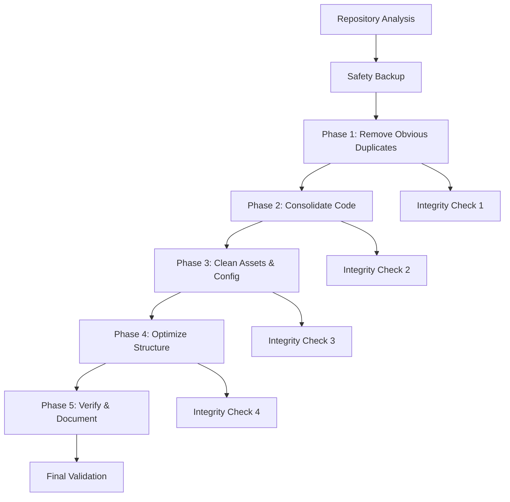

# Design Document: Repository Cleanup

## Overview

This design outlines a systematic approach to cleaning up a bloated repository containing duplicate files, legacy code, and organizational issues. The cleanup will be performed in phases to minimize risk and ensure system integrity throughout the process.

The cleanup strategy follows industry best practices: remove obvious duplicates first, consolidate related functionality, optimize assets, and verify system integrity at each step. This approach reduces technical debt while maintaining full functionality.

## Architecture

### Cleanup Pipeline Architecture



### Risk Mitigation Strategy

The cleanup follows a **progressive validation approach**:
- Each phase includes integrity checks
- Git commits after each successful phase
- Rollback capability at every step
- Import/reference validation before file removal

## Components and Interfaces

### 1. File Analysis Component

**Purpose**: Identify duplicate, legacy, and unnecessary files

**Key Functions**:
- `identifyDuplicateFiles()`: Find files with identical or near-identical content
- `findLegacyFiles()`: Locate .old files and their current counterparts
- `analyzeImportReferences()`: Map file dependencies and usage
- `detectUnusedAssets()`: Find unreferenced media and static files

**Interface**:
```typescript
interface FileAnalysis {
  duplicates: DuplicateGroup[];
  legacyFiles: LegacyFile[];
  unusedFiles: string[];
  importMap: ImportReference[];
}

interface DuplicateGroup {
  files: string[];
  similarity: number;
  recommendedAction: 'remove' | 'consolidate' | 'keep';
}
```

### 2. Code Consolidation Component

**Purpose**: Merge duplicate functionality into single authoritative files

**Key Functions**:
- `consolidateAuthStores()`: Merge auth-store.ts and auth-store.old.ts
- `mergeLambdaHandlers()`: Consolidate duplicate Lambda handlers
- `unifyConfigFiles()`: Merge configuration files appropriately
- `updateImportPaths()`: Fix import references after consolidation

**Interface**:
```typescript
interface ConsolidationPlan {
  sourceFiles: string[];
  targetFile: string;
  mergeStrategy: 'replace' | 'merge' | 'selective';
  preservedFeatures: string[];
}
```

### 3. Asset Optimization Component

**Purpose**: Clean up media files, remove unused assets, optimize directory structure

**Key Functions**:
- `removeUnusedAudio()`: Clean up unreferenced audio files
- `optimizeImageAssets()`: Remove duplicate or unused images
- `cleanupTempFiles()`: Remove debug, log, and temporary files
- `standardizeDirectories()`: Organize files into consistent structure

### 4. Integrity Validation Component

**Purpose**: Ensure cleanup doesn't break functionality

**Key Functions**:
- `validateImports()`: Check all import statements resolve
- `runBuildTests()`: Execute build processes
- `checkDeploymentScripts()`: Verify deployment still works
- `validateFunctionality()`: Test key application features

## Data Models

### Cleanup Configuration

```typescript
interface CleanupConfig {
  phases: CleanupPhase[];
  safetyChecks: SafetyCheck[];
  backupStrategy: BackupStrategy;
  rollbackPlan: RollbackPlan;
}

interface CleanupPhase {
  name: string;
  description: string;
  actions: CleanupAction[];
  validationSteps: ValidationStep[];
  rollbackPoint: boolean;
}

interface CleanupAction {
  type: 'remove' | 'consolidate' | 'move' | 'rename';
  sourceFiles: string[];
  targetFile?: string;
  conditions: string[];
}
```

### File Relationship Mapping

```typescript
interface FileRelationship {
  file: string;
  importedBy: string[];
  imports: string[];
  referencedIn: string[];
  canSafelyRemove: boolean;
  removalBlockers: string[];
}
```

## Correctness Properties

*A property is a characteristic or behavior that should hold true across all valid executions of a system-essentially, a formal statement about what the system should do. Properties serve as the bridge between human-readable specifications and machine-verifiable correctness guarantees.*

### Property Reflection

After analyzing all acceptance criteria, several properties can be consolidated to eliminate redundancy:

- File scanning properties (1.1, 4.1) can be combined into a general file pattern detection property
- Consolidation properties (1.4, 2.1, 2.2, 6.2) share similar merge logic and can use a common consolidation property
- Verification properties (3.5, 6.5, 7.4, 8.5, 10.1, 10.3, 10.4) all test system integrity and can be unified
- Documentation properties (9.1, 9.2, 9.3, 9.5) can be combined into a comprehensive documentation update property

### Core Properties

**Property 1: File Pattern Detection**
*For any* file pattern and directory tree, the scanning system should identify all files matching the specified pattern without missing any matches
**Validates: Requirements 1.1, 4.1**

**Property 2: Safe File Removal**
*For any* file marked for removal, the system should only remove it if no active imports or references exist, ensuring no broken dependencies
**Validates: Requirements 1.3, 1.5**

**Property 3: Content Comparison Accuracy**
*For any* pair of files being compared, the system should correctly identify whether the current version contains equivalent or superior functionality to the legacy version
**Validates: Requirements 1.2**

**Property 4: Consolidation Preservation**
*For any* set of files being consolidated, all working functionality from source files should be preserved in the target file
**Validates: Requirements 1.4, 2.1, 2.2, 2.4, 6.2**

**Property 5: Import Reference Updates**
*For any* file consolidation or move operation, all import statements referencing the old location should be updated to point to the new location
**Validates: Requirements 2.5, 8.4**

**Property 6: Single Source of Truth**
*For any* type of functionality (auth middleware, handlers, configs), only one authoritative file should exist after consolidation
**Validates: Requirements 2.3, 3.1**

**Property 7: Conditional Preservation**
*For any* file being evaluated for removal, essential files (deployment scripts, build tools, necessary configs) should be preserved while non-essential files are removed
**Validates: Requirements 3.4, 4.2, 4.3, 4.5**

**Property 8: Asset Reference Validation**
*For any* asset optimization operation, all assets that are referenced in code should remain available after cleanup
**Validates: Requirements 5.3, 5.5**

**Property 9: Directory Structure Standardization**
*For any* directory restructuring operation, the resulting structure should follow consistent naming conventions and organizational patterns
**Validates: Requirements 5.2, 8.1, 8.2**

**Property 10: Dependency Analysis Accuracy**
*For any* package.json analysis, the system should correctly identify which dependencies are actually used in the codebase
**Validates: Requirements 7.1, 7.3**

**Property 11: System Integrity Preservation**
*For any* cleanup operation, all build processes, tests, and deployment scripts should continue to work after the cleanup is complete
**Validates: Requirements 3.5, 6.5, 7.4, 8.5, 10.1, 10.3, 10.4**

**Property 12: Comprehensive Documentation**
*For any* cleanup operation that modifies files or structure, appropriate documentation should be generated describing what was changed and why
**Validates: Requirements 9.1, 9.2, 9.3, 9.5**

**Property 13: Empty Directory Cleanup**
*For any* directory that becomes empty after file removal, it should be removed unless it serves a specific purpose (like being required by build tools)
**Validates: Requirements 8.3**

<function_calls>
<invoke name="prework">
<parameter name="featureName">repository-cleanup

## Error Handling

### Rollback Strategy

The cleanup process implements comprehensive rollback capabilities:

1. **Git Checkpoint System**: Each phase creates a Git commit, allowing rollback to any previous state
2. **Backup Verification**: Before any destructive operation, verify backup integrity
3. **Dependency Validation**: Before removing files, validate no critical dependencies exist
4. **Build Verification**: After each phase, run build processes to ensure nothing is broken

### Error Recovery Patterns

```typescript
interface ErrorRecovery {
  phase: string;
  error: Error;
  rollbackPoint: string;
  recoveryActions: RecoveryAction[];
}

interface RecoveryAction {
  type: 'rollback' | 'skip' | 'manual_intervention';
  description: string;
  automaticRecovery: boolean;
}
```

### Critical Error Conditions

- **Import Resolution Failure**: If imports cannot be resolved after consolidation
- **Build Process Failure**: If builds fail after any cleanup phase
- **Deployment Script Failure**: If deployment processes break
- **Missing Essential Files**: If required files are accidentally removed

## Testing Strategy

### Dual Testing Approach

The repository cleanup system requires both unit tests and property-based tests to ensure comprehensive validation:

**Unit Tests**: Focus on specific scenarios and edge cases
- Test specific file patterns and known duplicates
- Verify consolidation of known auth store files
- Test removal of specific temporary files
- Validate specific import path updates

**Property-Based Tests**: Verify universal properties across all inputs
- Test file pattern detection across randomly generated directory structures
- Verify consolidation preservation across various file combinations
- Test import reference updates across different project structures
- Validate system integrity across various cleanup scenarios

### Property-Based Testing Configuration

Each property test will run a minimum of 100 iterations to ensure comprehensive coverage through randomization. Tests will be tagged with references to their corresponding design properties:

- **Feature: repository-cleanup, Property 1**: File pattern detection accuracy
- **Feature: repository-cleanup, Property 2**: Safe file removal validation
- **Feature: repository-cleanup, Property 4**: Consolidation functionality preservation
- **Feature: repository-cleanup, Property 11**: System integrity after cleanup

### Test Data Generation

Property tests will use intelligent generators that:
- Create realistic directory structures with various file types
- Generate files with different import patterns and dependencies
- Create duplicate files with varying degrees of similarity
- Simulate different project configurations and structures

### Integration Testing

Beyond unit and property tests, integration tests will:
- Test complete cleanup workflows on sample repositories
- Verify end-to-end functionality preservation
- Test rollback mechanisms under various failure conditions
- Validate documentation generation and accuracy

The testing strategy ensures that cleanup operations are safe, reliable, and maintain system integrity while achieving the desired repository optimization goals.