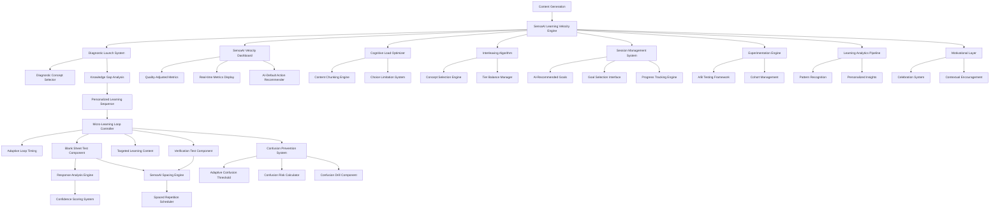

# SensaAI Learning Velocity Engine - Design Document

## Overview

The SensaAI Learning Velocity Engine represents a revolutionary transformation of the current SensaAI learning system, implementing cognitive science research to create measurably faster and more effective learning. This system replaces passive content consumption with active recall-first learning, implementing spaced repetition, interleaving, and cognitive load optimization as core architectural features.

The engine transforms the traditional "generate → consume" learning pattern into a scientifically-optimized "diagnose → test → learn → verify → repeat" cycle that maximizes learning velocity while minimizing cognitive overload.

## Architecture

### Core Architectural Principles

1. **Diagnostic-First Learning**: Every learning session begins with knowledge assessment, not content presentation
2. **Micro-Learning Loops**: 2-minute test→learn→verify cycles that optimize cognitive performance
3. **Active Recall Priority**: Testing precedes teaching in all learning interactions
4. **Cognitive Load Management**: Strict adherence to Miller's Law (7±2 elements) and cognitive load theory
5. **Spaced Repetition Engine**: Scientific interval scheduling based on forgetting curves
6. **Confusion Prevention**: Proactive identification and drilling of commonly confused concepts
7. **Session-Based Architecture**: Goal-oriented learning sessions with measurable outcomes

### System Architecture Diagram



## Components and Interfaces

### 1. SensaAI Diagnostic Launch System

**Purpose**: Replaces raw content display with immediate knowledge assessment using intelligent concept selection

**Interface**:
```typescript
interface DiagnosticLaunchSystem {
  launchDiagnostic(generatedContent: GeneratedContent): Promise<DiagnosticSession>;
  selectFoundationConcepts(concepts: LearningConcept[]): LearningConcept[];
  createKnowledgeChecks(concepts: LearningConcept[]): QuickKnowledgeCheck[];
  processResults(responses: DiagnosticResponse[]): KnowledgeGapAnalysis;
}

interface DiagnosticConceptSelector {
  rankFoundationConcepts(concepts: LearningConcept[]): RankedConcept[];
  criteria: {
    prerequisiteWeight: number;  // concepts that unlock others
    frequencyWeight: number;     // concepts used often
    abstractionWeight: number;   // prefer concrete over abstract for diagnostics
  };
}

interface DiagnosticSession {
  id: string;
  concepts: LearningConcept[];
  knowledgeChecks: QuickKnowledgeCheck[];
  timeLimit: number; // 3 minutes maximum
  startTime: Date;
}

interface QuickKnowledgeCheck {
  conceptId: string;
  question: string;
  type: 'multiple-choice' | 'true-false' | 'short-answer';
  expectedTime: number; // seconds
  confidenceRequired: boolean; // flag uncertain responses
}
```

**Key Behaviors**:
- Automatically launches when content generation completes
- Uses DiagnosticConceptSelector with explicit ranking criteria (prerequisite weight, frequency weight, abstraction weight)
- Selects 5-7 foundation concepts for assessment with confidence scoring
- Enforces 3-minute time limit for cognitive load management
- Immediately transitions to first micro-learning loop upon completion

### 2. Micro-Learning Loop Controller

**Purpose**: Orchestrates the test→learn→verify cycle with adaptive timing for optimal retention

**Interface**:
```typescript
interface MicroLearningLoopController {
  startLoop(conceptId: string): Promise<LoopResult>;
  executeBlankSheetTest(concept: LearningConcept): Promise<BlankSheetResult>;
  provideTargetedLearning(gaps: KnowledgeGap[]): Promise<LearningContent>;
  conductVerificationTest(concept: LearningConcept): Promise<VerificationResult>;
  scheduleSpacedRepetition(concept: LearningConcept, score: number): void;
}

interface AdaptiveLoopTiming {
  calculateOptimalDuration(concept: LearningConcept): number;
  factors: {
    conceptComplexity: number;     // intrinsic load
    userVelocityHistory: number;   // personal pace
    attemptNumber: number;         // first attempt vs. review
  };
  minDuration: 1;   // minutes
  maxDuration: 3;   // minutes
}

interface LoopResult {
  conceptId: string;
  duration: number; // milliseconds
  outcome: 'mastered' | 'needs-learning' | 'needs-review';
  nextAction: 'advance' | 'repeat' | 'schedule-review';
  adaptiveTiming: AdaptiveLoopTiming;
}

interface BlankSheetResult {
  conceptId: string;
  response: string;
  score: number; // 0-100
  timeSpent: number; // milliseconds
  wordCount: number;
  identifiedGaps: KnowledgeGap[];
  confidenceScore: number; // how certain is the analysis
}
```

**Key Behaviors**:
- Implements adaptive timing (1-3 minutes based on concept complexity and user velocity history)
- Always begins with blank sheet test
- Provides targeted learning only for identified gaps
- Automatically schedules successful concepts for spaced repetition
- Adapts duration based on concept complexity, user history, and attempt number

### 3. SensaAI Blank Sheet Test Component

**Purpose**: Implements active recall testing with intelligent gap analysis and confidence scoring

**Interface**:
```typescript
interface BlankSheetTestComponent {
  presentTest(concept: LearningConcept): BlankSheetTestInterface;
  trackTypingMetrics(input: string, timeSpent: number): TypingMetrics;
  analyzeResponse(response: string, conceptKeyPoints: string[]): ResponseAnalysis;
  calculateScore(analysis: ResponseAnalysis): number;
  identifyKnowledgeGaps(analysis: ResponseAnalysis): KnowledgeGap[];
}

interface BlankSheetTestInterface {
  prompt: string; // "Write everything you know about [concept]"
  textArea: HTMLTextAreaElement;
  minimumCharacters: number; // 50
  timeTracker: TypingTimeTracker;
  submitButton: HTMLButtonElement;
}

interface TypingMetrics {
  totalTimeSpent: number;
  wordCount: number;
  typingVelocity: number; // words per minute
  pausePatterns: number[]; // pause durations in milliseconds
}

interface ResponseAnalysis {
  keyPointsCovered: string[];
  keyPointsMissed: string[];
  accuracyScore: number;
  completenessScore: number;
  conceptualUnderstanding: number;
  confidenceScore: number;        // how certain is the analysis
  ambiguousElements: string[];    // what couldn't be scored reliably
  requiresManualReview: boolean;  // flag uncertain cases
}
```

**Key Behaviors**:
- Presents clean, distraction-free interface
- Requires minimum 50 characters before submission
- Tracks detailed typing metrics for velocity analysis
- Analyzes response against concept key points with confidence scoring
- Provides 0-100 score based on coverage of essential elements
- Flags uncertain analyses for manual review and offers follow-up questions when confidence is low

### 4. SensaAI Spacing Engine

**Purpose**: Implements scientifically-optimized review scheduling

**Interface**:
```typescript
interface SensaAISpacingEngine {
  scheduleInitialReview(conceptId: string): ScheduledReview;
  processReviewResult(reviewId: string, success: boolean): ScheduledReview | null;
  calculateNextInterval(currentInterval: number, success: boolean, confusionRisk: number): number;
  getDueReviews(userId: string): ScheduledReview[];
  prioritizeReviews(reviews: ScheduledReview[]): ScheduledReview[];
}

interface ScheduledReview {
  id: string;
  conceptId: string;
  userId: string;
  scheduledFor: Date;
  interval: number; // days
  attempt: number;
  confusionRisk: number; // 0-1
  urgencyScore: number; // calculated priority
}

interface SpacingIntervals {
  sequence: number[]; // [1, 3, 7, 14, 30] days
  confusionMultiplier: number; // 0.7 for concepts with confusion pairs
  resetInterval: number; // 1 day on failure
}
```

**Key Behaviors**:
- Schedules first review for 1 day after mastery
- Uses interval sequence: 1, 3, 7, 14, 30 days for successful reviews
- Resets to 1 day on failed reviews
- Applies 0.7 multiplier for concepts with confusion pairs
- Prioritizes due reviews over new concept learning
- Interleaves different concept types in review sessions

### 5. SensaAI Confusion Prevention System

**Purpose**: Proactively prevents concept confusion through targeted drilling with adaptive thresholds

**Interface**:
```typescript
interface ConfusionPreventionSystem {
  calculateConfusionRisk(conceptId: string, completedConcepts: string[]): number;
  triggerConfusionDrill(conceptId: string, riskScore: number): ConfusionDrill | null;
  createSideBySideComparison(concept1: LearningConcept, concept2: LearningConcept): ComparisonDrill;
  trackConfusionPrevention(drillId: string, success: boolean): void;
  adjustRiskThresholds(effectivenessData: EffectivenessMetrics): void;
}

interface AdaptiveConfusionThreshold {
  baseThreshold: 0.6;
  adjustForDomain(domain: string): number;
  adjustForLearner(learnerId: string, history: ConfusionHistory): number;
  adjustForEffectiveness(metrics: EffectivenessMetrics): number;
}

interface ConfusionDrill {
  id: string;
  primaryConceptId: string;
  confusedConceptId: string;
  comparisonType: 'side-by-side' | 'distinction-focus' | 'example-contrast';
  requiredActions: DrillAction[];
  timeLimit: number;
  adaptiveThreshold: AdaptiveConfusionThreshold;
}

interface DrillAction {
  type: 'identify-difference' | 'provide-example' | 'choose-correct' | 'explain-distinction';
  prompt: string;
  expectedResponse: string;
  positiveFraming: boolean; // always true
}

interface EffectivenessMetrics {
  drillsCompleted: number;
  confusionReductionRate: number;
  falsePositiveRate: number;
  learnerSatisfaction: number;
}
```

**Key Behaviors**:
- Calculates confusion risk after each concept completion
- Uses adaptive thresholds that adjust based on domain, learner history, and effectiveness metrics
- Triggers drill when risk exceeds personalized threshold (not fixed 60%)
- Presents side-by-side concept comparisons
- Requires learner to identify key differences and provide examples
- Marks concepts as "confusion-resistant" after successful drills
- Uses positive framing focusing on distinctions rather than mistakes
- Continuously adjusts thresholds based on effectiveness data

### 6. SensaAI Velocity Dashboard

**Purpose**: Provides real-time learning metrics and AI-recommended optimal actions

**Interface**:
```typescript
interface SensaAIVelocityDashboard {
  displayCurrentVelocity(): QualityAdjustedVelocityMetrics;
  showTrendIndicator(): TrendData;
  calculateOptimalAction(): OptimalAction;
  displayRetentionRate(): RetentionMetrics;
  recommendBreak(cognitiveLoad: number): BreakRecommendation | null;
  showSpacingAdherence(): AdherenceMetrics;
  updateMetricsRealTime(activity: LearningActivity): void;
}

interface QualityAdjustedVelocityMetrics {
  rawConceptsPerHour: number;
  retentionAdjustedVelocity: number;  // concepts × retention rate
  masteryDepthScore: number;          // how well concepts are understood
  sustainableVelocity: number;        // pace that maintains 90%+ retention
  velocityTrend: 'increasing' | 'stable' | 'decreasing';
}

interface OptimalAction {
  type: 'new-concept' | 'review-due' | 'confusion-drill' | 'break-needed';
  description: string;
  estimatedDuration: number;
  priority: 'high' | 'medium' | 'low';
  reasoning: string;
  aiRecommended: boolean;           // AI-default with user override option
  autoStartCountdown?: number;      // 5-second preview before auto-start
}

interface RetentionMetrics {
  rate24Hour: number; // percentage of concepts still known after 24 hours
  rate7Day: number;
  rate30Day: number;
  trendDirection: 'improving' | 'stable' | 'declining';
}
```

**Key Behaviors**:
- Displays quality-adjusted velocity (retention-weighted, not just raw speed)
- Shows trend indicator comparing current to previous sessions
- Provides AI-recommended optimal actions with 5-second auto-start countdown and user override
- Displays 24-hour retention rate percentage
- Recommends breaks with specific duration when cognitive load is high
- Updates all metrics in real-time as activities complete
- Emphasizes sustainable learning pace over raw speed

### 7. Cognitive Load Optimizer

**Purpose**: Manages intrinsic, eliminates extraneous, and maximizes germane cognitive load

**Interface**:
```typescript
interface CognitiveLoadOptimizer {
  chunkContent(content: LearningContent): ContentChunk[];
  limitChoices(options: any[]): any[];
  eliminateExtraneousElements(interface: UIInterface): UIInterface;
  maintainConsistency(elements: UIElement[]): UIElement[];
  provideRecognitionCues(context: LearningContext): RecognitionCue[];
  usePositiveFraming(instructions: string[]): string[];
}

interface ContentChunk {
  elements: LearningElement[];
  maxElements: number; // 7 maximum (Miller's Law)
  cognitiveLoadScore: number;
  chunkType: 'sequential' | 'hierarchical' | 'categorical';
}

interface UIInterface {
  elements: UIElement[];
  extraneous: UIElement[]; // to be removed
  essential: UIElement[]; // to be kept
  cognitiveLoadReduction: number;
}

interface RecognitionCue {
  type: 'visual' | 'textual' | 'contextual';
  content: string;
  placement: 'inline' | 'sidebar' | 'tooltip';
  reduces_recall_burden: boolean;
}
```

**Key Behaviors**:
- Breaks complex concepts into maximum 7 elements simultaneously
- Maintains consistent visual patterns and terminology
- Presents related information together spatially and temporally
- Removes decorative elements, marketing language, and seductive details
- Limits user choices to maximum 4 options
- Uses recognition over recall with prompts and cues

### 8. SensaAI Interleaving Algorithm

**Purpose**: Optimizes concept presentation order for enhanced discrimination and retention

**Interface**:
```typescript
interface SensaAIInterleavingAlgorithm {
  selectNextConcept(context: LearningContext): LearningConcept;
  avoidConsecutivePhases(lastPhase: LifecyclePhase, candidates: LearningConcept[]): LearningConcept[];
  balanceTierSelection(completedConcepts: string[], availableConcepts: LearningConcept[]): TierBalance;
  prioritizeConcepts(concepts: LearningConcept[], weights: PriorityWeights): LearningConcept[];
  trackConceptTypes(selectedConcept: LearningConcept): void;
  provideContextBridge(fromConcept: LearningConcept, toConcept: LearningConcept): ContextBridge;
}

interface TierBalance {
  foundation: number; // target 40%
  keystone: number;   // target 35%
  utility: number;    // target 25%
  currentDistribution: TierDistribution;
  recommendedTier: 'Foundation' | 'Keystone' | 'Utility';
}

interface PriorityWeights {
  prerequisiteSatisfaction: number; // 40%
  interleavingBenefit: number;      // 30%
  tierBalance: number;              // 30%
}

interface ContextBridge {
  fromConceptSummary: string;
  connectionExplanation: string;
  toConceptIntroduction: string;
  transitionType: 'contrast' | 'build-upon' | 'parallel' | 'application';
}
```

**Key Behaviors**:
- Avoids consecutive concepts from same lifecycle phase
- Balances selection across Foundation (40%), Keystone (35%), Utility (25%) tiers
- Prioritizes based on prerequisite satisfaction (40%), interleaving benefit (30%), tier balance (30%)
- Tracks last concept type and actively selects different types
- Overrides other factors when concept type avoided too long
- Activates only after basic understanding established
- Provides context bridges between different concept types

### 9. Experimentation Engine

**Purpose**: Enables A/B testing infrastructure for data-driven optimization of learning parameters

**Interface**:
```typescript
interface ExperimentationEngine {
  assignUserToCohort(userId: string, experiment: Experiment): Cohort;
  trackOutcome(userId: string, metric: Metric): void;
  analyzeResults(experiment: Experiment): ExperimentResults;
  createExperiment(config: ExperimentConfig): Experiment;
  getActiveExperiments(userId: string): Experiment[];
}

interface Experiment {
  id: string;
  name: string;
  description: string;
  variants: ExperimentVariant[];
  metrics: string[];
  startDate: Date;
  endDate: Date;
  targetSampleSize: number;
  status: 'draft' | 'active' | 'completed' | 'paused';
}

interface ExperimentVariant {
  id: string;
  name: string;
  description: string;
  parameters: Record<string, any>;
  trafficAllocation: number; // percentage 0-100
}

interface ExperimentResults {
  experimentId: string;
  variants: VariantResults[];
  statisticalSignificance: number;
  recommendedVariant: string;
  confidenceInterval: number;
}

interface VariantResults {
  variantId: string;
  sampleSize: number;
  metrics: Record<string, number>;
  conversionRate: number;
  statisticalPower: number;
}
```

**Key Behaviors**:
- Assigns users to experiment cohorts for testing spacing intervals, confusion thresholds, loop durations
- Tracks learning outcomes and performance metrics across variants
- Analyzes results with statistical significance testing
- Enables data-driven optimization of learning science assumptions
- Supports experiments like: [1,3,7,14,30] vs [1,2,5,10,20] spacing intervals, 0.5 vs 0.6 vs 0.7 confusion thresholds

### 10. Learning Analytics Pipeline

**Purpose**: Surfaces personalized insights and identifies optimal learning patterns

**Interface**:
```typescript
interface LearningAnalytics {
  identifyStrugglePatterns(userId: string): Pattern[];
  detectOptimalLearningTimes(userId: string): TimeWindow[];
  findHighEffectivenessTechniques(userId: string): Technique[];
  predictRetention(conceptId: string, userId: string): RetentionPrediction;
  generateInsights(userId: string): PersonalizedInsight[];
  analyzeContentQuality(conceptId: string, userScores: number[]): QualityAnalysis;
}

interface Pattern {
  type: 'struggle' | 'success' | 'plateau' | 'breakthrough';
  description: string;
  frequency: number;
  contexts: string[];
  recommendations: string[];
}

interface TimeWindow {
  startHour: number;
  endHour: number;
  dayOfWeek: string[];
  effectivenessScore: number;
  sampleSize: number;
}

interface PersonalizedInsight {
  category: 'performance' | 'timing' | 'technique' | 'content';
  title: string;
  description: string;
  actionable: boolean;
  recommendations: string[];
  confidence: number;
}

interface QualityAnalysis {
  conceptId: string;
  averageScore: number;
  completionRate: number;
  strugglingUsers: number;
  commonGaps: string[];
  improvementSuggestions: string[];
}
```

**Key Behaviors**:
- Identifies struggle patterns and optimal learning times for individual users
- Detects high-effectiveness techniques and predicts retention rates
- Generates actionable personalized insights from learning data
- Analyzes content quality and suggests improvements based on user performance
- Provides feedback loop to improve content generation and learning algorithms

### 11. Motivational Layer

**Purpose**: Provides emotional support and engagement to maintain learning motivation

**Interface**:
```typescript
interface MotivationalLayer {
  celebrateMilestones(achievement: Achievement): Celebration;
  provideEncouragement(struggle: StruggleSignal): EncouragementMessage;
  trackStreaks(userId: string): StreakData;
  shareProgress(with: 'self' | 'friends' | 'community'): ProgressShare;
  generateContextualMessages(context: LearningContext): MotivationalMessage;
}

interface Achievement {
  type: 'concept-mastery' | 'streak' | 'velocity' | 'retention' | 'consistency';
  level: 'bronze' | 'silver' | 'gold' | 'platinum';
  description: string;
  unlockedAt: Date;
  shareWorthy: boolean;
}

interface StruggleSignal {
  type: 'repeated-failure' | 'slow-progress' | 'confusion' | 'fatigue';
  intensity: 'mild' | 'moderate' | 'severe';
  context: string;
  duration: number; // minutes
}

interface EncouragementMessage {
  message: string;
  tone: 'supportive' | 'motivational' | 'educational' | 'reassuring';
  timing: 'immediate' | 'delayed' | 'next-session';
  actionSuggestion?: string;
}

interface MotivationalMessage {
  duringStruggle: "Struggling means learning—your brain is building new connections";
  afterBlankSheet: "You recalled X key points—that's retrieval practice in action";
  spacedReview: "You remembered this after 7 days—it's moving to long-term memory";
  confusionCleared: "Great distinction! You've strengthened your mental model";
  velocityImprovement: "Your learning pace improved 15% this session";
}
```

**Key Behaviors**:
- Celebrates milestones and achievements with appropriate recognition
- Provides contextual encouragement during struggle periods
- Tracks learning streaks and consistency metrics
- Enables progress sharing for social accountability
- Delivers educational context about learning science during activities
- Maintains positive, growth-oriented messaging throughout the learning journey

## Data Models

### Core Learning Models

```typescript
interface SensaAILearningSession {
  id: string;
  userId: string;
  subjectId: string;
  goal: SessionGoal;
  timeCommitment: number; // minutes
  startTime: Date;
  endTime?: Date;
  
  // Progress Tracking
  conceptsCompleted: string[];
  velocityAchieved: number; // concepts per hour
  retentionRate: number; // percentage
  confusionDrillsCompleted: number;
  
  // Cognitive Metrics
  cognitiveLoadScore: number;
  breaksTaken: number;
  optimalActionsFollowed: number;
  
  // Session Outcome
  goalAchieved: boolean;
  nextRecommendedSession: SessionRecommendation;
}

interface SessionGoal {
  type: 'master-new-concepts' | 'review-due-items' | 'confusion-drilling' | 'exploration';
  targetConcepts?: string[];
  targetCount?: number;
  description: string;
}

interface KnowledgeGapAnalysis {
  conceptId: string;
  identifiedGaps: KnowledgeGap[];
  overallComprehension: number; // 0-100
  recommendedLearningPath: string[];
  estimatedLearningTime: number; // minutes
}

interface KnowledgeGap {
  type: 'missing-concept' | 'incomplete-understanding' | 'misconception' | 'connection-missing';
  description: string;
  severity: 'low' | 'medium' | 'high';
  targetedContent: string;
  estimatedFillTime: number; // minutes
}

interface LearningVelocityMetrics {
  conceptsPerHour: number;
  blankSheetTestVelocity: number; // tests per hour
  verificationTestVelocity: number; // tests per hour
  retentionRate24Hour: number;
  retentionRate7Day: number;
  confusionRate: number; // percentage requiring drills
  spacingAdherence: number; // percentage on schedule
  cognitiveLoadOptimization: number; // efficiency score
}

interface SpacedRepetitionSchedule {
  conceptId: string;
  userId: string;
  currentInterval: number; // days
  nextReviewDate: Date;
  attemptCount: number;
  successStreak: number;
  confusionRisk: number;
  lastReviewScore: number;
  schedulingAlgorithm: 'standard' | 'confusion-adjusted' | 'cognitive-load-adjusted';
}
```

### Enhanced Concept Model

```typescript
interface SensaAILearningConcept extends LearningConcept {
  // Existing fields from base LearningConcept
  
  // SensaAI Learning Velocity Engine Extensions
  keyPoints: string[]; // for blank sheet test analysis
  commonMisconceptions: string[]; // for gap identification
  confusionPairs: ConfusionPair[]; // for prevention system
  cognitiveLoadFactors: CognitiveLoadFactor[];
  velocityOptimizations: VelocityOptimization[];
  
  // Diagnostic Assessment
  diagnosticQuestions: DiagnosticQuestion[];
  foundationLevel: boolean; // eligible for diagnostic inclusion
  
  // Micro-Learning Loop Configuration
  targetedLearningContent: TargetedContent[];
  verificationQuestions: VerificationQuestion[];
  masteryThreshold: number; // default 70%
  
  // Interleaving Properties
  interleavingCompatibility: string[]; // concept IDs that pair well
  contextBridges: Record<string, ContextBridge>; // bridges to other concepts
  
  // Quality and Analytics
  qualityMetrics: ConceptQualityMetrics;
  adaptiveParameters: AdaptiveConceptParameters;
}

interface ConceptQualityMetrics {
  averageCompletionTime: number;
  averageScore: number;
  strugglingUserPercentage: number;
  confusionRate: number;
  retentionRate24Hour: number;
  retentionRate7Day: number;
  improvementSuggestions: string[];
}

interface AdaptiveConceptParameters {
  optimalLoopDuration: number; // learned from user data
  effectiveConfusionThreshold: number; // personalized threshold
  recommendedPrerequisites: string[]; // data-driven prerequisites
  interleavingEffectiveness: Record<string, number>; // effectiveness with other concepts
}

interface CognitiveLoadFactor {
  type: 'intrinsic' | 'extraneous' | 'germane';
  description: string;
  loadScore: number; // 1-10
  mitigation?: string;
}

interface VelocityOptimization {
  technique: 'chunking' | 'scaffolding' | 'elaboration' | 'interleaving';
  description: string;
  expectedSpeedup: number; // percentage improvement
  applicablePhases: LifecyclePhase[];
}

interface TargetedContent {
  gapType: string;
  content: string;
  estimatedTime: number; // seconds
  interactionType: 'read' | 'practice' | 'example' | 'explanation';
  confidenceRequired: boolean; // flag if uncertain about effectiveness
}
```

### Session Management Models

```typescript
interface EnhancedSensaAILearningSession extends SensaAILearningSession {
  // Existing fields from base SensaAILearningSession
  
  // Enhanced Session Management
  aiRecommendation: SessionRecommendation;
  autoStartCountdown: number; // 5-second preview
  userOverride: boolean; // did user override AI recommendation
  
  // Experimentation
  activeExperiments: string[]; // experiment IDs user is enrolled in
  experimentVariants: Record<string, string>; // experiment -> variant mapping
  
  // Analytics Integration
  personalizedInsights: PersonalizedInsight[];
  strugglesIdentified: Pattern[];
  optimalLearningWindows: TimeWindow[];
  
  // Motivational State
  currentStreak: StreakData;
  recentAchievements: Achievement[];
  motivationalContext: MotivationalContext;
}

interface SessionRecommendation {
  action: string;
  estimatedMinutes: number;
  reason: string;
  conceptIds: string[];
  confidence: number; // AI confidence in recommendation
  alternatives: AlternativeRecommendation[];
}

interface AlternativeRecommendation {
  action: string;
  reason: string;
  estimatedMinutes: number;
  priority: 'high' | 'medium' | 'low';
}

interface MotivationalContext {
  currentMood: 'energetic' | 'focused' | 'struggling' | 'tired';
  sessionGoalProgress: number; // 0-100
  encouragementNeeded: boolean;
  celebrationPending: boolean;
  lastEncouragementTime: Date;
}
```

## Correctness Properties

*A property is a characteristic or behavior that should hold true across all valid executions of a system—essentially, a formal statement about what the system should do. Properties serve as the bridge between human-readable specifications and machine-verifiable correctness guarantees.*

### Property Reflection

After analyzing all acceptance criteria, I identified several areas where properties can be consolidated to eliminate redundancy:

**Consolidation Opportunities:**
- Properties 1.1, 1.5, 2.1 all test automatic transitions between system states - these can be combined into a comprehensive "System Flow Property"
- Properties 4.1, 4.2, 4.3 all test spacing interval behavior - these can be unified into a single "Spacing Algorithm Property"
- Properties 6.1, 6.2, 6.7 all test dashboard metric updates - these can be combined into a "Real-time Metrics Property"
- Properties 8.1, 8.4, 8.5 all test interleaving avoidance behavior - these can be unified into an "Interleaving Balance Property"

**Final Property Set (After Consolidation):**

### Property 1: Diagnostic-First Learning Flow
*For any* content generation completion, the system should launch a diagnostic assessment with 5-7 foundation concepts, complete within 3 minutes, analyze results for knowledge gaps, and immediately start the first micro-learning loop
**Validates: Requirements 1.1, 1.2, 1.3, 1.4, 1.5**

### Property 2: Micro-Learning Loop Structure
*For any* concept in a learning session, the system should present it in a test→learn→verify sequence, begin with a blank sheet test, provide targeted learning only for scores below 70%, conduct verification after learning, and complete within 2 minutes
**Validates: Requirements 2.1, 2.2, 2.3, 2.4, 2.5, 2.6, 2.7**

### Property 3: Blank Sheet Test Validation
*For any* blank sheet test, the system should require minimum 50 characters, track typing metrics, analyze against concept key points, provide 0-100 scores, and identify specific knowledge gaps
**Validates: Requirements 3.2, 3.3, 3.4, 3.5, 3.6**

### Property 4: Spacing Algorithm Consistency
*For any* concept mastery or review completion, the system should schedule first review for 1 day, follow the sequence [1,3,7,14,30] days for successes, reset to 1 day for failures, apply 0.7 multiplier for confusion pairs, and prioritize due reviews over new concepts
**Validates: Requirements 4.1, 4.2, 4.3, 4.4, 4.5, 4.6, 4.7**

### Property 5: Confusion Prevention Activation
*For any* completed concept, the system should calculate confusion risk, trigger drills when risk exceeds 60%, present side-by-side comparisons, require difference identification, mark concepts as confusion-resistant after completion, and track effectiveness for threshold adjustment
**Validates: Requirements 5.1, 5.2, 5.4, 5.5, 5.6**

### Property 6: Real-time Dashboard Metrics
*For any* learning activity completion, the dashboard should update velocity in concepts per hour, show trend indicators, recommend optimal actions from the defined set, display 24-hour retention rates, recommend breaks for high cognitive load, and show spacing adherence percentages
**Validates: Requirements 6.1, 6.2, 6.3, 6.4, 6.5, 6.6, 6.7**

### Property 7: Cognitive Load Limitation
*For any* content presentation or choice interface, the system should limit simultaneous elements to maximum 7 (Miller's Law) and limit user choices to maximum 4 options
**Validates: Requirements 7.2, 7.6**

### Property 8: Interleaving Balance Maintenance
*For any* concept selection, the system should avoid consecutive concepts from the same lifecycle phase, maintain Foundation (40%), Keystone (35%), Utility (25%) tier balance, prioritize using prerequisite satisfaction (40%), interleaving benefit (30%), and tier balance (30%) weights, track concept types to avoid repetition, and override other factors when types avoided too long
**Validates: Requirements 8.1, 8.2, 8.3, 8.4, 8.5, 8.6, 8.7**

### Property 9: Learning Velocity Metrics Tracking
*For any* learning activity, the system should track concepts mastered per hour as primary metric, calculate retention by testing at 24 hours, record blank sheet scores and timing, track confusion rate as percentage requiring drills, measure spacing adherence as on-schedule completion percentage, calculate cognitive load optimization scores, and store all metrics persistently for trend analysis
**Validates: Requirements 9.1, 9.2, 9.3, 9.4, 9.5, 9.6, 9.7**

### Property 10: Session-Based Learning Architecture
*For any* learning session start, the system should require goal selection from [master new concepts, review due items, confusion drilling, exploration], offer time options [15, 30, 45, 60, custom] minutes, provide AI recommendations based on learning state, track progress toward stated goals with real-time percentages, complete current micro-loops before ending when time expires, provide summaries with concepts completed and velocity achieved, and save progress for seamless resumption when interrupted
**Validates: Requirements 10.1, 10.2, 10.3, 10.4, 10.5, 10.6, 10.7**

## Error Handling

### Diagnostic Assessment Errors

**Timeout Handling**:
- If diagnostic exceeds 3-minute limit, auto-submit with partial responses
- Analyze available responses and proceed with conservative gap analysis
- Log timeout events for cognitive load optimization

**Invalid Response Handling**:
- Reject responses below minimum character thresholds
- Provide immediate feedback for invalid input formats
- Offer simplified question formats for struggling learners

**Technical Failure Recovery**:
- Cache diagnostic progress locally for network interruptions
- Provide offline diagnostic capability for core assessments
- Graceful degradation to simplified assessment if full system unavailable

### Micro-Learning Loop Errors

**Blank Sheet Test Failures**:
- Handle empty or invalid submissions with guided prompts
- Provide fallback scoring when analysis engine fails
- Offer alternative input methods for accessibility

**Content Delivery Errors**:
- Cache targeted learning content for offline access
- Provide alternative content sources when primary fails
- Fallback to basic concept explanations if targeted content unavailable

**Verification Test Issues**:
- Allow manual verification override for technical failures
- Provide alternative verification methods (oral, visual, practical)
- Skip verification with warning if critical system components fail

### Spacing Engine Errors

**Scheduling Conflicts**:
- Resolve overlapping review schedules with priority algorithms
- Handle timezone changes and daylight saving transitions
- Manage bulk rescheduling for system maintenance windows

**Data Consistency Issues**:
- Validate interval calculations against business rules
- Detect and correct scheduling anomalies automatically
- Provide manual override capabilities for edge cases

### Cognitive Load Management Errors

**Overload Detection**:
- Monitor for signs of cognitive overload (slow responses, errors, frustration)
- Automatically trigger break recommendations when thresholds exceeded
- Reduce content complexity dynamically based on performance

**System Performance Impact**:
- Gracefully degrade real-time features under high load
- Prioritize core learning functions over analytics during stress
- Implement circuit breakers for non-essential services

## Testing Strategy

### Dual Testing Approach

The SensaAI Learning Velocity Engine requires both unit testing and property-based testing to ensure comprehensive coverage and correctness validation.

**Unit Testing Focus**:
- Specific diagnostic question formats and validation
- Edge cases in blank sheet test scoring algorithms with confidence scoring
- Spacing interval calculations for boundary conditions
- Confusion risk calculation accuracy with adaptive thresholds
- Dashboard metric computation correctness for quality-adjusted metrics
- Session state transitions and error recovery
- Experimentation framework cohort assignment and result analysis

**Property-Based Testing Focus**:
- Universal properties that hold across all learning content types
- Comprehensive input coverage through randomization
- Cognitive load optimization across diverse scenarios
- Interleaving algorithm behavior with various concept distributions
- Spacing engine consistency across different user patterns
- Adaptive system behavior under varying conditions

### Property-Based Testing Configuration

**Testing Framework**: Use Hypothesis (Python) or fast-check (TypeScript) for property-based testing
**Minimum Iterations**: 100 iterations per property test
**Test Tagging Format**: **Feature: sensa-ai-learning-velocity-engine, Property {number}: {property_text}**

### Property Test Implementation Requirements

Each correctness property must be implemented as a single property-based test:

1. **Property 1 Test**: Generate random content, verify diagnostic launches with 5-7 foundation concepts using intelligent selection criteria, completes within 3 minutes, and transitions to micro-learning
   - **Tag**: Feature: sensa-ai-learning-velocity-engine, Property 1: Diagnostic-First Learning Flow

2. **Property 2 Test**: Generate random concepts, verify test→learn→verify sequence with adaptive timing (1-3 minutes), blank sheet test initiation, 70% threshold behavior, and completion within adaptive duration
   - **Tag**: Feature: sensa-ai-learning-velocity-engine, Property 2: Micro-Learning Loop Structure

3. **Property 3 Test**: Generate random text inputs, verify 50-character minimum, metrics tracking, analysis execution with confidence scoring, 0-100 scoring, and gap identification with manual review flagging
   - **Tag**: Feature: sensa-ai-learning-velocity-engine, Property 3: Blank Sheet Test Validation

4. **Property 4 Test**: Generate random mastery/review events, verify 1-day initial scheduling, [1,3,7,14,30] sequence, failure resets, confusion multipliers, and prioritization
   - **Tag**: Feature: sensa-ai-learning-velocity-engine, Property 4: Spacing Algorithm Consistency

5. **Property 5 Test**: Generate random concept completions, verify risk calculation, adaptive threshold triggering, comparison presentations, and effectiveness tracking
   - **Tag**: Feature: sensa-ai-learning-velocity-engine, Property 5: Confusion Prevention Activation

6. **Property 6 Test**: Generate random learning activities, verify real-time quality-adjusted velocity updates, trend indicators, AI-default action recommendations, retention displays, and adherence metrics
   - **Tag**: Feature: sensa-ai-learning-velocity-engine, Property 6: Real-time Dashboard Metrics

7. **Property 7 Test**: Generate random content and choice sets, verify 7-element maximum for content and 4-option maximum for choices
   - **Tag**: Feature: sensa-ai-learning-velocity-engine, Property 7: Cognitive Load Limitation

8. **Property 8 Test**: Generate random concept pools, verify phase avoidance, tier balance maintenance, weighted prioritization, type tracking, and override behavior
   - **Tag**: Feature: sensa-ai-learning-velocity-engine, Property 8: Interleaving Balance Maintenance

9. **Property 9 Test**: Generate random learning activities, verify concepts/hour tracking, 24-hour retention testing, score recording, confusion rate calculation, and persistent storage
   - **Tag**: Feature: sensa-ai-learning-velocity-engine, Property 9: Learning Velocity Metrics Tracking

10. **Property 10 Test**: Generate random session starts, verify AI-recommended goal selection with user override, time options, AI recommendations with reasoning, progress tracking, graceful ending, and resumption capability
    - **Tag**: Feature: sensa-ai-learning-velocity-engine, Property 10: Session-Based Learning Architecture

### Integration Testing Strategy

**End-to-End Learning Flows**:
- Complete diagnostic → micro-learning → spaced repetition cycles with adaptive timing
- Multi-session learning journeys with interruptions and resumptions
- Cross-device session continuity and data synchronization
- Experimentation framework integration with learning flows

**Performance Testing**:
- Cognitive load optimization under various content complexities
- Real-time metric updates under high concurrent user loads
- Spacing engine performance with large user bases and review schedules
- Analytics pipeline performance with large datasets

**Accessibility Testing**:
- Screen reader compatibility for all learning interfaces
- Keyboard navigation through complete learning flows
- High contrast and reduced motion support validation

### Test Data Generation

**Synthetic Learning Content**:
- Generate concepts with varying complexity levels and quality metrics
- Create realistic confusion pair relationships with adaptive thresholds
- Simulate diverse user response patterns and confidence levels

**User Behavior Simulation**:
- Model different learning velocities and patterns
- Simulate various cognitive load scenarios and adaptive responses
- Generate realistic session interruption patterns
- Model experimentation cohort behaviors

**Edge Case Coverage**:
- Boundary conditions for all timing constraints and adaptive parameters
- Extreme values for scoring and metrics calculations with confidence bounds
- Network failure and recovery scenarios
- Experimentation framework edge cases and statistical significance testing

## Key Design Improvements

Based on comprehensive user feedback, the design incorporates several critical enhancements:

### 1. Adaptive Systems Replace Fixed Parameters
- **Adaptive Loop Timing**: 1-3 minute loops based on concept complexity and user velocity history (replaces rigid 2-minute constraint)
- **Adaptive Confusion Thresholds**: Personalized thresholds based on domain, learner history, and effectiveness (replaces fixed 60% threshold)
- **Quality-Adjusted Velocity**: Retention-weighted learning velocity metrics (replaces raw speed focus)

### 2. Confidence Scoring and Quality Assurance
- **Response Analysis Confidence**: Blank sheet test analysis includes confidence scoring and manual review flagging
- **Diagnostic Concept Selection**: Intelligent ranking criteria (prerequisite weight, frequency weight, abstraction weight)
- **Content Quality Feedback**: Analytics pipeline provides content improvement suggestions based on user performance

### 3. AI-Default User Experience
- **Session Goal Selection**: AI recommends optimal goals with 5-second auto-start countdown and user override option
- **Reduced Cognitive Load**: Recognition over recall with AI-guided decisions reducing choice fatigue

### 4. Experimentation and Analytics Infrastructure
- **A/B Testing Framework**: Built-in experimentation engine for validating learning science assumptions
- **Learning Analytics Pipeline**: Personalized insights, struggle pattern identification, and optimal learning time detection
- **Data-Driven Optimization**: Continuous improvement based on real user data and effectiveness metrics

### 5. Motivational and Emotional Support
- **Contextual Encouragement**: Educational messaging about learning science during struggle periods
- **Achievement System**: Milestone celebrations and streak tracking for sustained engagement
- **Positive Framing**: Growth-oriented messaging throughout the learning journey

### 6. Enhanced Error Handling and Reliability
- **Graceful Degradation**: Fallback systems for component failures and network issues
- **Confidence-Based Routing**: Uncertain analyses trigger alternative pathways or manual review
- **Robust State Management**: Session persistence and seamless resumption capabilities

These improvements transform the SensaAI Learning Velocity Engine from a rigid system into an adaptive, intelligent learning companion that continuously optimizes based on individual user needs and scientific evidence.