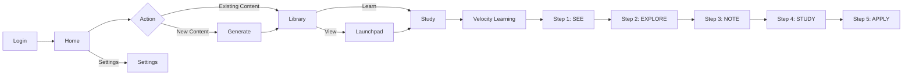

# SensaPBL UI/UX Walkthrough

> **Version:** E2E UI/UX V1  
> **Captured:** January 12, 2026  
> **App:** SensaAI - Velocity Learning Platform

---

## Complete Workflow Order

---

## 1. Authentication Flow

### Login Page
Premium split-screen design with motivational quote and credential fields.

**Elements:**
- Hero quote panel (Abigail Adams)
- Email/Password inputs
- Sign In button with gradient styling
- Sign Up navigation link

---

## 2. Core Navigation

### Home Page (Cloud Library)
Entry point for all learning activities. Search-first interface for subject generation.

**Elements:**
- Subject search input with placeholder examples
- Target Exam/Context optional field
- "Generate Learning System" primary action button
- Recent subject tags (Azure Administrator, MCAT Biology, CPA Tax Accounting)
- Bottom navigation: Cloud Library | Saved Results | Settings

---

### Generate Page (Content Creation)
AI-powered 4-pass content generation pipeline.

**Elements:**
- 4-Pass pipeline: Domain Analysis → Dependency Mapping → Content Generation → Quality Validation
- Real-time status messages ("Exploring the knowledge landscape")
- Overall progress bar with percentage
- Estimated time remaining
- Cancel option

---

### Library (Saved Results)
Repository of generated learning content.

**Elements:**
- Subject cards with domain, concept count, and creation date
- Quality and Lifecycle metrics (95%)
- Action buttons: View | Learn | Delete
- Search/filter by subject, domain, or role
- Sort by Date dropdown
- Import File option

---

## 3. Pre-Learning Dashboard

### Content Launchpad
Analytics and readiness dashboard before entering a learning session.

**Primary Metrics:**
- Mastery Index: 44%
- Content Depth Score: 95%
- Estimated Mastery Time: 103 mins
- Content Coverage bar

**Dependency Tiers:**
- Foundation: 6 concepts
- Keystone: 5 concepts  
- Utility: 2 concepts

**AI Quality Analysis:**
- Q_P (Preparation): 88%
- Q_M (Modeling): 100%
- Q_f (Fluency): 50%
- G (Governance): 100%

---

## 4. Study Command Center

### Study Page Overview
Dual-tab interface for intellectual mapping and active learning.

**Elements:**
- Overview / Velocity tab navigation
- Session status bar (Optimal, Focused)
- Tier Structure flowchart: Foundation → Keystone → Utility
- Sub-tabs: Tier Structure | Predict Links | Gap Priming

---

## 5. Velocity Learning Flow (5-Step SENSA Method)

### Step 1: SEE (The Why) - Goal Setting
Connect with personal motivation before learning. Sets **G** (Governance).

**Elements:**
- Motivation selection: Career growth, Curious mind, Exam prep, Build something, Stay relevant
- Audio coaching toggle
- Music toggle
- Skip option

---

### Step 2: EXPLORE (Survey) - Builds Q_P (Preparation)

#### 2.1 Tier Structure
Scan the conceptual hierarchy before diving deep.

**Elements:**
- Foundation → Keystone → Utility flow visualization
- Concept cards with mnemonic keywords (Line, Suite, Books, Tree)

#### 2.2 Predict Links
Hypothesis formation about concept relationships.

#### 2.3 Gap Priming
Identify knowledge gaps before detailed study.

---

### Step 3: NOTE (Map Building) - Builds Q_M (Modeling)
Interactive concept mapping canvas.

**Elements:**
- Draggable concept cards
- Auto-layout nodes button
- Coach suggestions for connections
- Progress notification (30-minute goal)
- "Finished Map" completion button

---

### Step 4: STUDY (Reconstruct) - Refines Q_M & Q_P

#### 4.1 Make It Real (Worked Example)
Contextualize concepts with real-world scenarios.

**Example Scenario:**
> "REAL: Rolls-Royce (2020) automated data preparation for aerospace engine diagnostics using Power Query, consolidating 47 different source formats..."

#### 4.2 Blank Sheet Test (Active Recall)
Reconstruct knowledge without external cues.

**Prompts:**
- Key concepts and definitions
- How it works or how to use it
- Why it matters
- Any examples you remember

---

### Step 5: APPLY (Synthesis) - Sets Q_f (Fluency)
*Mastery challenges and speed drills (not captured in this session)*

---

## 6. Utility Pages

### Settings
User customization and data management.

**Sections:**
- **Appearance:** Light / Dark / System theme
- **Learning Profile:** Retake onboarding quiz
- **AI Companion:** Coach selection (Study Buddy), Voice toggle, Intensity slider (1-5)
- **Data Management:** Concepts learned, time studied, Export Data
- **Danger Zone:** Account/data deletion

---

## Complete Workflow Summary

| Phase | Page | Purpose | Equation Variable |
|-------|------|---------|------------------|
| Auth | Login | Authentication | - |
| Entry | Home | Subject entry/search | - |
| Creation | Generate | AI content generation | - |
| Library | Saved Results | Content management | - |
| Dashboard | Launchpad | Analytics & readiness | I_baseline |
| Command | Study | Session configuration | - |
| Step 1 | SEE | Goal setting | **G** |
| Step 2 | EXPLORE | Survey & prediction | **Q_P** |
| Step 3 | NOTE | Map building | **Q_M** |
| Step 4 | STUDY | Reconstruction | Q_M, Q_P |
| Step 5 | APPLY | Synthesis & drills | **Q_f** → **I** |
| Utility | Settings | Customization | - |
