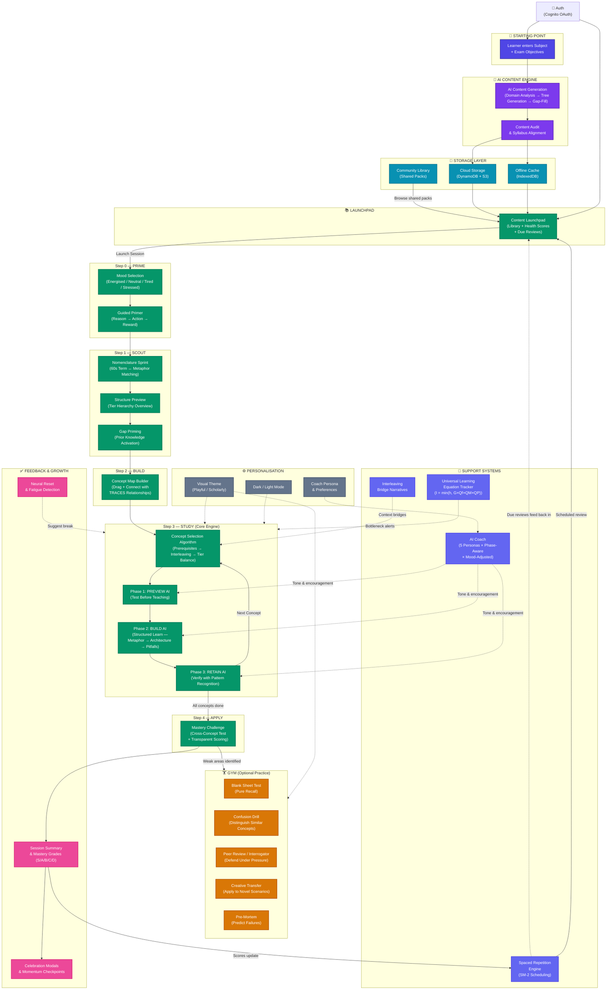
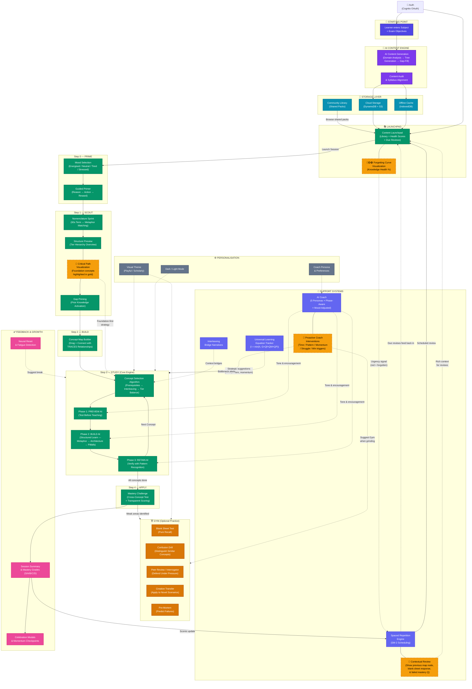

# SensaAI — Feature Success Criteria

> **What does "it's working" look like for each feature, in plain English?**
> Below every feature section is a simple bullet list a non-technical person can read and nod along to.
> At the bottom is a Mermaid diagram showing how every feature feeds into the next to create one seamless learning journey — from "I don't know this subject" to "I can recall and reason through it cold."

---

## 1. AI Content Generation

- The learner types in a subject (e.g. "AWS Solutions Architect") and the app produces a complete, organised study pack — no copy-pasting from textbooks.
- The study pack is structured like a tree: big topics at the top (trunks), sub-topics in the middle (branches), and bite-sized facts at the bottom (leaves).
- Every concept comes with a metaphor, a hook sentence, worked examples, and common mistakes — not just dry definitions.
- If the AI misses important topics from the learner's exam syllabus, the system automatically detects the gaps and generates extra content to fill them.
- Low-quality or generic filler content is rejected before the learner ever sees it.

---

## 2. Content Audit & Syllabus Alignment

- The learner can paste their official exam syllabus or learning objectives, and the app checks whether the generated content actually covers everything.
- Each concept is tagged as "aligned to objective," "supplementary," or "not in objectives" — so the learner knows exactly what's exam-relevant and what's bonus.
- The tier distribution (big topics vs. granular details) is validated so the study pack isn't lopsided.
- Bloom's taxonomy spread is checked — the pack must include higher-order thinking (analyse, evaluate, create) and not just memorisation.

---

## 3. Content Launchpad (Library Dashboard)

- The learner sees all their saved study packs in one place — like a personal bookshelf of everything they've generated.
- Each study pack shows a health score: tier balance, Bloom's distribution, and objective coverage at a glance.
- Spaced-repetition reminders surface concepts that are due for review — so the learner doesn't forget what they learned last week.
- One click launches the learner straight into a study session for any pack.

---

## 4. Mood-Based Session Curation (PRIME Step)

- Before studying, the learner simply picks how they're feeling: Energised, Neutral, Tired, or Stressed.
- The app automatically adjusts session length and difficulty based on that mood — no fiddly settings to configure.
- When energised: longer, harder session. When tired: short, gentle review. The learner never has to push through when they're not up for it.
- A "Guided Primer" step helps the learner set an intention (why am I studying? what will I do with this? what's my reward?) — so every session starts with purpose.

---

## 5. Nomenclature Sprint (SCOUT Step)

- A 60-second speed round where the learner matches subject terms to their plain-English metaphors.
- Acts as a vocabulary warm-up — by the time they start the real study, the jargon already feels familiar.
- A 90% accuracy gate ensures the learner actually knows the language before diving deeper — no pretending to understand.
- The learner previews the topic structure and makes predictions about which concepts are most important — activating prior knowledge before formal learning.

---

## 6. Concept Map Builder (BUILD Step)

- The learner drags and connects concepts visually — like drawing a mind map on a whiteboard.
- Each connection has a labelled relationship type (requires, enables, is-part-of, is-type-of, causes, constrains) — forcing the learner to think about *how* ideas relate, not just *that* they relate.
- Graph rules prevent nonsensical connections (e.g. a leaf concept can't require a concept from a different branch) — so the map stays logically sound.
- An always-visible legend explains each relationship type in plain language — no guessing what the labels mean.

---

## 7. Micro-Learning Loop (STUDY Step — The Core Engine)

- For every single concept, the learner goes through three phases:
  - **Test First** — Answer a question *before* being taught, to expose what you don't know.
  - **Learn** — Read a structured breakdown: metaphor, architecture, execution, system physics, pitfalls, high-stakes scenario, and a "think deeper" prompt.
  - **Verify** — Answer a pattern-recognition question to confirm the concept stuck.
- This "test → learn → verify" cycle is backed by retrieval practice research — the struggle of recalling before learning is what makes it stick.
- No fake questions are generated. If the AI didn't produce a quality diagnostic question, the concept's test phase is skipped rather than faking it.

---

## 8. Concept Selection Algorithm

- The app picks the *next* concept to study intelligently — not randomly and not in a fixed order.
- Prerequisite concepts are taught first (you learn "addition" before "multiplication").
- The algorithm interleaves different tiers and cognitive levels — so the learner isn't bored by ten easy facts in a row, but also isn't overwhelmed by ten hard concepts in a row.
- Concepts that unlock the most other concepts ("keystone" topics) are prioritised — like learning the foundation that makes everything else click.

---

## 9. Spaced Repetition & Interleaving

- After learning a concept, the app schedules future review dates based on how well the learner performed — the better you did, the longer before you need to revisit it.
- Reviews are surfaced as due items on the dashboard — the learner just shows up and the app tells them what to revise.
- When transitioning between concepts, the app generates a narrative bridge ("X requires Y — let's build on that foundation") — so the learner understands *why* they're switching topics, not just *that* they are.

---

## 10. Mastery Challenge (APPLY Step)

- A cross-concept test that combines multiple ideas — the learner can't pass by knowing isolated facts; they must connect them.
- Scoring is transparent: the learner sees exactly which keywords they hit, which gaps remain, and five actionable tips for improvement.
- Mastery grades (S/A/B/C/D) give a clear signal of progress — no vague "good job."

---

## 11. The Gym (Optional Practice Zone)

- A pressure-free practice area with eight different activity types:
  - Concept Map Builder, Blank Sheet Test, Confusion Drill, Peer Review (Interrogator), Creative Transfer, Nomenclature Sprint, Mastery Challenge, and Pre-Mortem.
- **Never blocks the learner** — the Gym is for voluntary practice, not punishment. You can always move forward.
- Rich, actionable feedback after every attempt — word count, concept coverage, depth analysis, strengths, gaps, and five tips.
- "Try Again" is the primary button (encouraging retry) but "Next Concept" and "Back to Gym" are always available — respecting the learner's autonomy.

---

## 12. Blank Sheet Test

- The learner writes everything they can remember about a concept on a "blank sheet" — pure recall with no prompts.
- AI-powered scoring evaluates depth, keyword coverage, and structural understanding — not just word count.
- Forces the learner to organise knowledge from memory, which is the single strongest study technique according to learning science.

---

## 13. Confusion Drill

- Presents pairs of easily-confused concepts side by side and asks the learner to distinguish them.
- Targets the exact "I always mix these up" pain point — the areas where learners lose marks in exams.
- Triggered automatically when the system detects the learner is confusing similar concepts.

---

## 14. AI Coach & Persona System

- The learner picks a coach personality (from five options), and all feedback messages are adapted to that persona's tone and style.
- The coach adjusts for the learning phase (intro, encouragement, struggle, success, transition) — so the tone matches what the learner needs in the moment.
- The coach is mood-aware: if the learner said they're tired, the coach is gentler; if energised, more challenging.

---

## 15. Universal Learning Equation Tracker

- A live dashboard showing the learner's "learning absorption" score: **I = min(h, G × Q_f × Q_M × Q_P)**.
- Each factor (mood bandwidth, content quality, review frequency, mastery depth, process fidelity) is visualised — the learner can see which variable is their weakest link.
- When process quality drops below a threshold, the system warns "grinding is futile right now" and suggests backtracking — preventing wasted effort.
- A mastery threshold progress bar shows how close the learner is to the 75% target.

---

## 16. Visual Theme System (Playful / Scholarly)

- Two distinct visual modes: **Playful** (friendly emojis, soft edges, warm colours — great for younger learners) and **Scholarly** (crisp borders, monochromatic palette, strong typography — for university-level credibility).
- Works independently of dark/light mode — four total combinations (Playful Light, Playful Dark, Scholarly Light, Scholarly Dark).
- Scholarly mode strips all emojis and replaces them with text labels or icons — the interface looks like it belongs at a serious institution.
- Instant switching from the Settings panel with live preview.

---

## 17. Cloud Storage & Offline Support

- Study packs are saved to the cloud (DynamoDB) as the source of truth — accessible from any device.
- An offline cache (IndexedDB) lets the learner keep studying even without internet — everything syncs when they're back online.
- Import/export in JSON, PDF, and Markdown formats — the learner owns their data.
- If a generation job is interrupted (browser crash, lost connection), the app recovers the background job automatically.

---

## 18. Community Library

- A shared space where learners can discover study packs created by others.
- Reduces the "blank page" problem — a learner can start from someone else's pack and customise it.

---

## 19. Authentication & Access Control

- Secure login via AWS Cognito (OAuth PKCE) — email confirmation, password reset, social sign-in.
- Content generation is gated to an allowlist of approved users — preventing abuse of the AI generation pipeline.
- Session management handles token refresh, so the learner stays logged in without friction.

---

## 20. Settings & Personalisation

- Central settings panel for visual theme, dark/light mode, coach persona, metaphor toggle, and practice mode preferences.
- All preferences persist across sessions — the app remembers how the learner likes to work.

---

## 21. Session Feedback & Celebration

- Celebration modals appear on milestone achievements — positive reinforcement that makes progress feel rewarding.
- Skip reason capture: when a learner skips a concept, they explain why (already know it, too hard, not relevant) — giving the system data to improve future sessions.
- Neural Reset banner detects cognitive fatigue and suggests a break — preventing burnout.
- Momentum checkpoints and session time toasts keep the learner aware of their progress and elapsed time.

---

## 22. Synoptic View (Relationship Map)

- A bird's-eye view of all concepts and their TRACES connections (requires, enables, is-part-of, is-type-of, causes, constrains).
- The learner can zoom in on any cluster to understand the dependency web.
- A help overlay explains the six relationship types in child-friendly language — so even a first-time user can read the map.

---

## How It All Fits Together



---

## Reading the Diagram — The Logic of Recall & Reasoning

The diagram above isn't just a feature map — it's the **cognitive journey** a learner takes from ignorance to mastery:

1. **Nomenclature First** → You can't reason about a subject if you don't speak its language. The Sprint ensures term fluency *before* deep study.
2. **Structure Before Detail** → The Concept Map forces the learner to see the forest before the trees. Relationships (TRACES) build the mental scaffold that individual facts hang on.
3. **Test Before Teach** → Preview AI deliberately exposes gaps. This "desirable difficulty" makes the subsequent learning phase dramatically more effective.
4. **Learn with Layers** → Build AI doesn't dump information — it layers metaphor → architecture → execution → pitfalls → high-stakes, building understanding from intuition to precision.
5. **Verify While Fresh** → Retain AI locks in the concept with a pattern-recognition check before the learner moves on.
6. **Interleave & Space** → The algorithm ensures variety (preventing rote repetition) and the spacing engine schedules future reviews at scientifically optimal intervals.
7. **Apply Across Concepts** → Mastery Challenge forces *integration* — the learner must combine multiple concepts, proving they can reason, not just recall.
8. **Gym for Targeted Weakness** → Weak areas identified in the main flow can be attacked with specialised drills (confusion, recall, transfer, pre-mortem) in a pressure-free zone.
9. **Feedback Closes the Loop** → Scores feed back into the spaced repetition engine, celebration reinforces effort, and fatigue detection prevents diminishing returns.

**The result**: a learner who can both **recall** the terminology of their subject (nomenclature) and **reason** through its structure (relationships, dependencies, applications) — which is the definition of true understanding.

---

# 🗺️ Roadmap Enhancements (Approved)

> **Selection Criteria**: Every enhancement below follows one rule — **surface data the system already captures but currently hides from the learner.** No new infrastructure. No social platforms. No multi-modal research projects. Just finishing the job by making the invisible visible.

---

## Enhancement A: Contextual Spaced Repetition

_Currently: the app says "Review Concept X." Enhanced: the app says "Remember when you learned X and connected it to Y? Here's what you wrote last time."_

- When a concept comes up for review, the learner sees their **own history** with that concept — not a cold prompt.
- Their original **Concept Map** is shown with the relevant node highlighted, so they can see where this concept sits in the bigger picture.
- Their previous **Blank Sheet Test** response is displayed — "this is what you remembered last time, can you beat it?"
- If they failed a **Mastery Challenge** question that involved this concept, that specific question is surfaced — "this is the gap that tripped you up."
- **Why it matters**: Episodic memory (remembering *your experience* of learning something) triggers recall far more powerfully than semantic memory (being told "here's a fact again"). This is the difference between a flashcard app and a learning partner that knows your journey.

---

## Enhancement B: Critical Path Visualisation in SCOUT

_Currently: SCOUT shows the tier hierarchy (trunks, branches, leaves). Enhanced: SCOUT highlights the 5 concepts that unlock 80% of the rest._

- During the Structure Preview, **foundation concepts** (those with the highest outdegree — meaning the most other concepts depend on them) are highlighted in gold.
- The learner sees a clear message: "These 5 concepts unlock 80% of everything else — they're your foundation."
- The learner gets a strategic choice: **"Study foundations first"** (safer, more structured) or **"Jump to advanced"** (riskier, faster if you already know the basics).
- Prerequisite chains are shown as a **critical path** — so the learner can see *why* learning A before B matters, not just that the app told them to.
- **Why it matters**: The concept selection algorithm already calculates outdegree bonuses and enabler scores. The data exists — the learner just can't see it. Making the strategy visible transforms the learner from a passenger following instructions into a navigator choosing their route.

---

## Enhancement C: Forgetting Curve Visualisation

_Currently: the spacing engine schedules reviews silently. Enhanced: the learner can see their knowledge fading in real time._

- Each concept gets a **decay indicator** on the Content Launchpad and Mastery Dashboard:
  - 🟢 **Green** — Fresh in memory (reviewed within the last 24 hours)
  - 🟡 **Yellow** — Fading (review due soon)
  - 🔴 **Red** — Probably forgotten (overdue for review)
- An overall **"Knowledge Health"** percentage shows how much of the study pack is still in the green zone.
- Hovering a concept shows its specific decay curve: when it was last reviewed, when it's due next, and how many successful recalls it's had.
- If a cluster of related concepts all turn red at the same time, the system suggests a **targeted review session** for that branch — not random concepts, but the connected group.
- **Why it matters**: Spaced repetition only works if the learner actually shows up for reviews. Abstract "you have 5 concepts due" doesn't create urgency. Watching your knowledge *visibly decay from green to red* does. It makes the invisible forgetting curve feel real and personal.

---

## Enhancement D: Proactive AI Coach Interventions

_Currently: the coach reacts to phases and mood. Enhanced: the coach reads the session and makes strategic suggestions before the learner asks._

- **Time-based**: "You've been in STUDY for 90 minutes — research shows diminishing returns after this point. Take a break or switch to Gym?"
- **Pattern-based**: "You've skipped 3 concepts in a row marked 'too hard' — want to drop to an easier tier for the rest of this session?"
- **Momentum-based**: "You're 2 sessions away from mastering this entire pack — push through today or save it for tomorrow when you're fresher?"
- **Struggle-based**: "You've scored below 40% on the last 3 verify questions — let's go back to the Concept Map and rebuild the connections before continuing."
- **Win-based**: "You just got 3 S-grades in a row — you're in flow. I'm going to queue up the hardest remaining concepts while you're sharp."
- All interventions are **suggestions, never blocks** — the learner can dismiss any prompt with one click (respecting the core autonomy principle).
- **Why it matters**: The session state data (time elapsed, skip count, score trends, concepts remaining) is already tracked. The coach just needs trigger rules to interpret it. This transforms the coach from a *commentator who reacts* into a *strategist who anticipates* — the difference between a supportive friend and an expert tutor.

---

## How the Enhancements Plug In



> **Legend**: Nodes with a **dashed amber border** (🟡) are the four roadmap enhancements. They plug into existing nodes — no new infrastructure required.

---

## Reading the Enhanced Diagram — What Changes

The four enhancements strengthen three critical transition points in the learning journey:

### 1. The "Why Should I Review?" Problem → Solved by Enhancements A + C

Without these, spaced repetition is a **nag** ("5 concepts due"). With them, it becomes a **story**:
- The **Forgetting Curve** (C) makes the problem visible — "your knowledge of Concept X has decayed to red."
- The **Contextual Review** (A) makes the solution personal — "here's your concept map with X highlighted, here's what you wrote last time, here's the mastery question that tripped you up."

The learner doesn't just *comply* with the review schedule — they *understand why it matters* and *remember their own journey* with the concept.

### 2. The "What Should I Study First?" Problem → Solved by Enhancement B

Without this, the learner trusts the algorithm blindly. With it, they can **see the strategy**:
- "These 5 foundation concepts unlock 80% of everything else."
- "If you already know these, you can skip ahead safely."

The learner becomes a **navigator**, not a passenger. They understand *why* the system recommends a particular order, and they can make an informed choice to follow or override it.

### 3. The "I'm Stuck But Don't Know Why" Problem → Solved by Enhancement D

Without this, the learner grinds until the Equation Tracker warns them (reactive). With it, the coach **reads the session** and intervenes early (proactive):
- 3 skips in a row → "Let's drop difficulty."
- 90 minutes elapsed → "Diminishing returns — break time."
- 3 S-grades in a row → "You're in flow — I'm queuing the hardest concepts."

The coach shifts from spectator to **strategist** — the single biggest upgrade to the learner's experience of being *guided*, not just *tested*.

---

**All four enhancements share one trait: they use data the system already collects to give the learner insight it currently keeps to itself. That's not overengineering — that's finishing the product.**

---

# 🧩 UI Placement Rationale (Wireframe Validation)

> **Purpose**: Before committing to the roadmap, each enhancement was smoke-tested for UI placement. The goal: confirm that none of them require new pages, new layouts, sidebars, or modals — they all piggyback on existing component patterns the app already uses.

---

## Enhancement A: Contextual Spaced Repetition — UI Placement

### Decision: Inline collapsible panel at the top of the review session

When a concept is a **scheduled review** (not first-time learning), an extra collapsible section appears at the top of `MicroLearningLoopController`'s Preview AI phase, before the diagnostic question.

```
┌─────────────────────────────────────────────────────┐
│ 📎 Your History with "VPC Fundamentals"   [▼ Expand]│
│─────────────────────────────────────────────────────│
│ • Last reviewed: 3 days ago                         │
│ • Your blank sheet response:                        │
│   "VPCs isolate network traffic using subnets..."   │
│ • Your map connection: VPC → requires → Subnets     │
│ • Missed mastery Q: "How does VPC peering affect    │
│   routing tables across regions?"                   │
└─────────────────────────────────────────────────────┘
│                                                      │
│  Now — can you do better?                            │
│  ┌─────────────────────────────────────────────┐     │
│  │  [Preview AI question appears here as usual] │     │
│  └─────────────────────────────────────────────┘     │
```

### Why this placement

| Option | Verdict | Reason |
|--------|---------|--------|
| **Modal** | ❌ Rejected | Interrupts flow — learner has to dismiss it before starting. Friction. |
| **Sidebar** | ❌ Rejected | App has no sidebar layout during STUDY. Adding one is a layout rewrite across `VelocityLearning.tsx` and `MicroLearningLoopController.tsx`. |
| **Inline collapsible** | ✅ Chosen | Follows the same pattern as `NeuralResetBanner` and `MomentumCheckpoint` — a dismissible card inline with the flow. Zero new layout paradigms. |

### Existing pattern reused

`NeuralResetBanner` (`src/components/learning/ui/NeuralResetBanner.tsx`) — a soft banner that appears contextually at the top of the study view. The "Your History" panel uses the same CSS structure: rounded card, subtle background, dismiss/collapse button.

### Data sources (all already exist)

- Previous blank sheet response → `learning-store.ts` (session progress)
- Concept map connections → stored in generation output (`connections[]`)
- Failed mastery questions → `learning-store.ts` (score tracking)
- Last review date → `spacing-engine.ts` (interval tracking)

### New components needed

1× `ReviewContextPanel.tsx` — collapsible card, ~80 lines. No new stores, no new API calls.

---

## Enhancement B: Critical Path Visualisation — UI Placement

### Decision: Gold highlight ring on existing hierarchy nodes + one-line banner + two strategy buttons

No new screen or step. The critical path is shown **on the existing Structure Preview** inside `SessionScoutPreview`, by visually distinguishing the 5 highest-outdegree concepts.

```
┌──────────────────────────────────────────────────────┐
│  Structure Preview                                    │
│                                                       │
│  ★ "These 5 concepts unlock 80% of the rest —        │
│     they're your foundation"                          │
│                                                       │
│       ┌──────────────┐                                │
│       │   Trunk A    │                                │
│       └──────┬───────┘                                │
│     ┌────────┴────────┐                               │
│  ┌──┴───────────┐  ┌──┴───────────┐                   │
│  │ ★ Branch B   │  │   Branch C   │                   │
│  │ ╔═gold ring═╗│  │              │                   │
│  └──────────────┘  └──────┬───────┘                   │
│                   ┌───────┴───────┐                    │
│                ┌──┴──────┐  ┌────┴─────┐              │
│                │ ★ Leaf D│  │  Leaf E  │              │
│                │ (gold)  │  │          │              │
│                └─────────┘  └──────────┘              │
│                                                       │
│  ┌─────────────────────┐ ┌───────────────────────┐    │
│  │ Study foundations   │ │ Jump to advanced      │    │
│  │ first (recommended) │ │ (skip if you know     │    │
│  │                     │ │  the basics)          │    │
│  └─────────────────────┘ └───────────────────────┘    │
└──────────────────────────────────────────────────────┘
```

### Why this placement

| Option | Verdict | Reason |
|--------|---------|--------|
| **Separate "Critical Path" step** | ❌ Rejected | SCOUT already has 3 sub-steps (Structure → Sprint → Gap Priming). A 4th slows the onramp to learning. |
| **Separate page** | ❌ Rejected | Overengineering. The data fits naturally on the existing view. |
| **Overlay on existing hierarchy** | ✅ Chosen | Gold ring = CSS border change on 5 nodes. Banner = one `<p>` tag. Buttons = two `<button>` elements that set a flag. Total additions: ~30 lines of JSX, ~15 lines of CSS. |

### Existing pattern reused

`SessionScoutPreview` (`src/components/learning/session/SessionScoutPreview.tsx`) already renders the tier hierarchy with visual distinctions per tier. Adding a gold border to 5 nodes follows the same conditional-styling pattern already used for tier badge colours.

### Data sources (all already exist)

- Outdegree per concept → calculated by `transformer.ts` during generation
- Enabler connections → `connections[type='enables']` in concept data
- Prerequisite chains → `concept-selection.ts` already computes these

### New components needed

0× new components. CSS additions to existing `SessionScoutPreview.module.css` (~15 lines) + two buttons + one boolean flag on `concept-selection.ts` (`prioritiseFoundations: boolean`).

---

## Enhancement C: Forgetting Curve — UI Placement

### Decision: Two-layer progressive disclosure — dot first, hover-panel later

**Layer 1 (ship first)**: A 12px coloured dot on each concept card in `ContentLaunchpad` + a "Knowledge Health: X%" stat in the Launchpad header bar.

```
┌──────────────────────────────────────────────────────┐
│  📚 AWS Solutions Architect                           │
│  Tier Health: 82% │ Bloom's: ✓ │ Knowledge: 73% 🟡  │  ← new stat
│──────────────────────────────────────────────────────│
│  🟢 VPC Fundamentals            Trunk    Bloom B5    │
│  🟡 IAM Policies                Branch   Bloom B4    │  ← dot colour
│  🔴 Cross-Region Replication    Leaf     Bloom B3    │
│  🟢 S3 Bucket Policies          Leaf     Bloom B5    │
│  🔴 Route 53 DNS                Branch   Bloom B4    │
│  🟡 CloudWatch Metrics          Leaf     Bloom B3    │
└──────────────────────────────────────────────────────┘
```

**Layer 2 (later, optional)**: Hovering the "Knowledge: 73%" header stat expands a panel inside the existing `MasteryDashboard` showing per-concept decay curves. This is a tab or section within the dashboard — no new route.

```
┌──────────────────────────────────────────────────────┐
│  Knowledge Health Detail            [▲ Collapse]      │
│──────────────────────────────────────────────────────│
│  VPC Fundamentals    ████████████░░ 85%  Due in 4d   │
│  IAM Policies        ██████░░░░░░░ 52%  Due tomorrow │
│  Cross-Region Repl.  ██░░░░░░░░░░░ 18%  OVERDUE 3d  │
│  S3 Bucket Policies  ████████████░░ 90%  Due in 6d   │
│──────────────────────────────────────────────────────│
│  ⚠ 3 related concepts in "Networking" branch are     │
│  all red — [Launch targeted review session]           │
└──────────────────────────────────────────────────────┘
```

### Why this placement

| Option | Verdict | Reason |
|--------|---------|--------|
| **Separate "Knowledge Health" dashboard page** | ❌ Rejected | Adds a new route. The data belongs where the learner already goes — the Launchpad. |
| **Replace existing health scores** | ❌ Rejected | Existing health scores (tier balance, Bloom's) serve different purposes. Knowledge decay is additive, not a replacement. |
| **Dot per card + header stat** | ✅ Chosen (Layer 1) | A 12px dot is CSS-only. The header stat is one `<span>`. Total: ~20 lines of CSS, ~10 lines of JSX. |
| **Hover-panel in MasteryDashboard** | ✅ Chosen (Layer 2) | `MasteryDashboard` already exists. Adding a "Knowledge Health" section is a new `<div>` inside an existing component. |

### Existing pattern reused

`ContentLaunchpad` (`src/components/learning/launchpad/ContentLaunchpad.tsx`) already renders per-concept cards with tier badges and Bloom's badges. The decay dot follows the same badge pattern — conditional CSS class based on a computed value.

### Data sources (all already exist)

- Last review date → `spacing-engine.ts`
- Next review date → `spacing-engine.ts`
- Interval / successful recall count → `spacing-engine.ts`
- Concept relationships (for "related cluster" detection) → `connections[]`

### New components needed

Layer 1: 0× new components. CSS dot + one header stat line.
Layer 2: 1× `KnowledgeHealthPanel.tsx` — expandable section inside `MasteryDashboard`, ~100 lines.

---

## Enhancement D: Proactive AI Coach — UI Placement

### Decision: Dismissible banner (same pattern as `NeuralResetBanner`)

Coach interventions appear as a soft, coloured banner at the top of the study view — visible but never blocking. The learner can act on it or dismiss it with `[✕]`.

```
┌─────────────────────────────────────────────────────┐
│ 🎯 Coach says:                                 [✕]  │
│ "You've been studying for 90 minutes — research     │
│ shows diminishing returns after this point."         │
│                                                      │
│  [Take a 10-min Break]    [Switch to Gym]            │
└─────────────────────────────────────────────────────┘
│                                                      │
│  ┌─────────────────────────────────────────────┐     │
│  │  [Normal STUDY phase content below]          │     │
│  └─────────────────────────────────────────────┘     │
```

### Intervention trigger examples

| Trigger | Data Source | Message | Actions |
|---------|-----------|---------|---------|
| 90+ min elapsed | Session timer (already tracked in `VelocityLearning.tsx`) | "Diminishing returns after 90 min" | [Break] [Gym] [✕] |
| 3 consecutive skips | Skip counter (already tracked in `learning-store.ts`) | "Want to drop to an easier tier?" | [Drop Tier] [Continue] [✕] |
| 3 verify scores < 40% | Score history (already tracked in `learning-store.ts`) | "Let's rebuild connections first" | [Back to Map] [Continue] [✕] |
| 3 consecutive S-grades | Score history (already tracked) | "You're in flow — queuing hardest concepts" | [Let's Go] [✕] |
| 2 sessions from full mastery | Mastery count (already tracked) | "Push through or save for tomorrow?" | [Push] [Save] [✕] |

### Why this placement

| Option | Verdict | Reason |
|--------|---------|--------|
| **Toast (sonner)** | ❌ Rejected | Toasts auto-dismiss in 3–5 seconds. Strategic suggestions need time to read and decide. A toast that says "you've been grinding for 90 minutes" then vanishes in 3 seconds is useless. |
| **Modal** | ❌ Rejected | Modals block the screen. A coach suggestion that *forces* a response violates the core autonomy principle ("suggestions, never blocks"). |
| **Always-visible sidebar** | ❌ Rejected | No sidebar exists in STUDY layout. Adding one is a layout rewrite — and a permanently visible coach is annoying when no intervention is needed. |
| **Dismissible banner** | ✅ Chosen | Same pattern as `NeuralResetBanner`. Visible but not blocking. Dismiss with one click. Appears only when triggered — invisible otherwise. |

### Existing pattern reused

`NeuralResetBanner` (`src/components/learning/ui/NeuralResetBanner.tsx`) — renders a soft banner at the top of the study view when cognitive fatigue is detected. `CoachInterventionBanner` uses the identical layout, CSS structure, and dismiss pattern. The only difference is the trigger logic and message content.

### Data sources (all already exist)

- Session elapsed time → `VelocityLearning.tsx` state
- Skip count + reasons → `learning-store.ts` via `handleSkipReasonConfirm()`
- Score history → `learning-store.ts` (completed concepts + scores)
- Concepts remaining → `concept-selection.ts` (remaining pool size)
- Current mood → `personalization-store.ts`

### New components needed

1× `CoachInterventionBanner.tsx` — dismissible banner, ~120 lines. Trigger logic lives in `VelocityLearning.tsx` or `MicroLearningLoopController.tsx` as a `useEffect` with threshold checks.

---

## Complexity Summary

| Enhancement | New Components | New Routes/Pages | Layout Changes | CSS Lines | JSX Lines | New API Calls | Complexity |
|------------|---------------|-----------------|---------------|-----------|-----------|--------------|------------|
| **A** — Context Review | 1 (`ReviewContextPanel`) | 0 | 0 | ~30 | ~80 | 0 | **Low** |
| **B** — Critical Path | 0 | 0 | 0 | ~15 | ~30 | 0 | **Low** |
| **C** — Forgetting Curve (Layer 1) | 0 | 0 | 0 | ~20 | ~10 | 0 | **Low** |
| **C** — Forgetting Curve (Layer 2) | 1 (`KnowledgeHealthPanel`) | 0 | 0 | ~60 | ~100 | 0 | **Medium** |
| **D** — Proactive Coach | 1 (`CoachInterventionBanner`) | 0 | 0 | ~40 | ~120 | 0 | **Low** |
| **TOTAL** | **3 components** | **0 routes** | **0 layout changes** | **~165 lines** | **~340 lines** | **0 calls** | **Low** |

### Verdict

**No UI nightmares.** Total new code across all four enhancements: ~500 lines (3 small components + minor CSS/JSX additions to existing files). Zero new pages. Zero new API calls. Zero layout rewrites. Every enhancement reuses an existing UI pattern the app already has.

**Recommended build order:**
1. **C Layer 1** (Forgetting Curve dots) — smallest change, immediate visual impact
2. **B** (Critical Path gold rings) — CSS-only on existing view
3. **D** (Proactive Coach banner) — highest learning-experience upgrade
4. **A** (Context Review panel) — richest feature, builds on spacing data
5. **C Layer 2** (Knowledge Health detail panel) — optional polish
