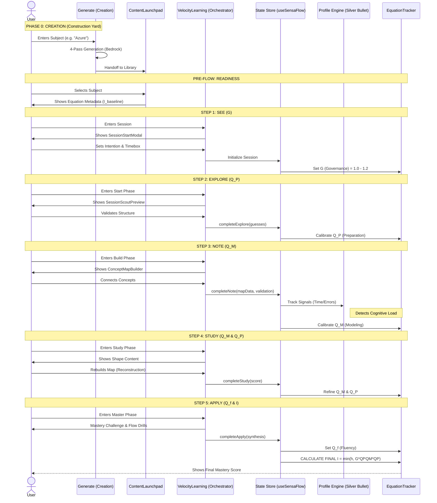

# SensaPBL Application Blueprint
> **Version:** 2.0 (SENSA FULL THROTTLE)
> **Last Updated:** January 9, 2026

---

## 1. Executive Summary

SensaPBL ("Velocity") is an AI-powered learning acceleration platform designed to compress the time-to-mastery for complex technical subjects. It replaces traditional linear learning with a **5-Step Universal Learning Flow** based on the mathematical principle that mastery (I) is a product of governance, preparation, modeling, and fluency.

**Core Philosophy:**
- **Velocity over Volume:** Learn only what matters fundamental concepts first (Tiers).
- **Active Construction:** Build mental models, don't just consume video.
- **Measurable Mastery:** Track "Insight" (I) using a quantifiable equation.

---

## 2. Core Architecture: SENSA v2.0

The entire application is driven by the **Universal Learning Equation**:

$$ I = \min(h, G \times Q_f \times Q_M \times Q_P) $$

| Variable | Name | Component Logic |
|----------|------|-----------------|
| **I** | **Mastery Index** | The calculated score (0.0 - 1.0). Target mastery is >0.75. |
| **h** | **Human Limit** | Natural cognitive cap (typically 1.0, reduced by fatigue). |
| **G** | **Governance** | Environment tracking. Set in **Step 1: See**. |
| **Q_P** | **Preparation** | Quality of inputs & initial understanding. Builds in **Step 2/3**. |
| **Q_M** | **Modeling** | Quality of the mental map structure. Builds in **Step 3/4**. |
| **Q_f** | **Fluency** | Speed of retrieval and application. Tested in **Step 5**. |

### The 5-Step Flow
1.  **SEE (Goal Setting):** Set intent, timebox, and primer. (Sets **G**)
2.  **EXPLORE (Survey):** Rapid tier-based visualization and prediction without reading deep content. (Builds **Q_P**)
3.  **NOTE (Map Building):** Drag-and-drop concept mapping to structure knowledge. (Builds **Q_M**, validates **Q_P**)
4.  **STUDY (Reconstruct):** Active recall testing and deep reading of "Shape" content. (Refines **Q_M**)
5.  **APPLY (Synthesis):** Boss battles and speed drills. (Sets **Q_f**, Finalizes **I**)

---

## 3. Feature Catalog

### A. The Launchpad (Home)
Entry point for all learning.
- **Subject Library:** Grid of available subjects.
- **Flow Progress Bar:** Visual indicator of the 5-step journey.
- **Equation Metadata Card:** Displays AI-generated quality baselines (e.g., "This content is 95% complete").
- **Tier Distribution:** Visualization of Foundation vs. Keystone vs. Utility concepts.

### B. Velocity Learning Engine
The primary "Play" mode.
- **Orchestrator:** `VelocityLearning.tsx` manages the state machine.
- **Equation Tracker:** Real-time HUD showing G, Q_P, Q_M, Q_f values updating as the user interacts.
- **Components:**
    - **SessionScoutPreview:** Interactive 3-step survey (Structure -> Visual -> Prime).
    - **ConceptMapBuilder:** Visually build dependencies. AI validation feedback on connection accuracy.
    - **MapReconstructionTest:** "Fade-out" test where users must rebuild the map from memory.
    - **MasteryChallenge:** Scenario-based synthesis questions + "Flow Mode" speed drills.
    - **MicroLearningLoop:** The reading interface for "Shape" content.

### C. The Palace (Memory Visualization)
Spatial navigation of knowledge.
- **3D/2D Map View:** Visualizes the `DependencyGraph` returned by the AI.
- **Memory Anchors:** Displays emojis/icons generated by the mnemonic system.

### D. AI Content Adapter
The brain of the operation.
- **System Prompt v4:** Advanced instructions for DeepSeek/o1 to generate structured JSON.
- **Parsers:** `parseEnhancedAIResponse` validates tiers, circular dependencies, and equation metadata.
- **Validators:** Ensures content meets strict SENSA v2.0 quality gates before loading.

---

## 4. System Component Map (File Blueprint)

### `/src/components`
#### `/learning`
- **`VelocityLearning.tsx`**: MAIN CONTROLLER. Wires `useSensaFlow` to UI.
- **`SessionScoutPreview.tsx`**: Implementation of Step 2 (Explore).
- **`ConceptMapBuilder.tsx`**: Implementation of Step 3 (Note).
- **`MapReconstructionTest.tsx`**: Implementation of Step 4 (Study).
- **`MasteryChallenge.tsx`**: Implementation of Step 5 (Apply).
- **`MicroLearningLoopController.tsx`**: Legacy card reader (being refactored into Study phase).
- **`launchpad/ContentLaunchpad.tsx`**: Dashboard UI for selecting content.

#### `/pages`
- **`Generate.tsx`**: The "Construction Yard". Handles the 4-pass AI generation process.
- **`SavedResults.tsx`**: The "Library" view. Lists all generated subjects.

#### `/ui`
- **`EquationTracker.tsx`**: The equation HUD widget.
- **`FlowProgressBar.tsx`**: The 5-step progress stepper.
- **`TierExplainer.tsx`**: Modal explaining Foundation/Keystone/Utility.

### `/src/lib`
#### `/ai`
- **`system-prompt.ts`**: The massive prompt sent to the LLM.
- **`content-analytics.ts`**: Analysis logic for determining content quality.

#### `/content-adapter`
- **`parse-ai-response.ts`**: Validates JSON from LLM against SENSA schemas.
- **`transformer.ts`**: Converts raw JSON into app-consumable `LearningConcept` objects.
- **`validate-tier-progression.ts`**: Logic for gating access based on tiers.

#### `/types`
- **`sensa-flow.types.ts`**: DEFINITIVE source of truth for all Equation interfaces (`EquationMetadata`, `SensaFlowState`, etc.).
- **`learning.ts`**: Core domain types (`LearningConcept`, `ConceptMapData`).

### `/src/hooks`
- **`useSensaFlow.ts`**: The React hook implementing the equation state machine.
- **`useLearningStore.ts`**: Global Zustand store for session persistence.

---

## 5. Data Architecture Schema

### Concept Object (The Atom)
Every concept must match this shape:
```typescript
interface LearningConcept {
  id: string;
  name: string;
  tier: 'foundation' | 'keystone' | 'utility';
  dependencies: string[]; // references IDs
  outdegree: number;      // calculated influence score
  lifecycle: 'PHASE_1' | 'PHASE_2' | 'PHASE_3';
  mnemonic: {
    anchor: string; // e.g., "Volcano 🌋"
    story: string;
  };
  shape: {
    S: string; // Simple Core
    H: string; // High stakes
    A: string; // Analogy
    P: string; // Pattern
    E: string; // Elimination
  };
}
```

### Equation Metadata (The Quality Seal)
```typescript
interface EquationMetadata {
    Q_P: { score: number, components: { atomicity: number, ... } };
    Q_M: { score: number, components: { graphCompleteness: number, ... } };
    Q_f: { score: number, components: { shapeCompleteness: number, ... } };
    G: { score: number };
    I_baseline: { value: number }; // The starting potential of the content
}
```

---

## 6. Prompt Engineering Strategy

To generate valid content, the System Prompt enforces:
1.  **Root-Level Tiers:** `tier` must be on the concept object, not just nested.
2.  **Dependency Graph:** A dedicated `dependencyGraph` JSON block for map visualization.
3.  **Equation Metadata:** AI must self-grade the content using the SENSA rubric and output `equationMetadata`.
4.  **Positive Framing:** Strict prohibition of negative phrasing ("Don't do X" -> "Optimized for Y").
5.  **Aphantasia Support:** Narrative fallbacks for visual metaphors.

---

## 7. Future Roadmap (Post v2.0)
- **Onboarding Tour:** Walkthrough for first-time users explaining the equation.
- **Adaptive Q_f:** Adjust Flow Mode difficulty based on typing speed/performance.
- **Multi-Subject Graph:** Linking concepts across different subjects (e.g., Azure + AWS networking).

---

## 8. Sequential Interaction Flow

This diagram illustrates the user journey through the SENSA v2.0 system and how the Universal Learning Equation updates at each stage.



---

## 9. Core Integrations & Engines

Beyond the learning flow, three specialized engines power the experience.

### A. The "Silver Bullet" Predictive Engine
*File: `src/lib/learning/profile-detector.ts`*

Automatically detects learning profiles based on behavioral signals, removing the need for upfront quizzes.

| Signal | Threshold | Inference | Action |
|--------|-----------|-----------|--------|
| **Time Per Concept** | > 180s | Cognitive Overload | Recommend Velocity Mode |
| **Error Streak** | > 3 | Knowledge Gap | Trigger Micro-Loop Review |
| **Revisit Rate** | > 3x | Low Retention | Suggest Map Reconstruction |

### B. Voice Synthesis Engine (ElevenLabs)
*File: `src/hooks/useVoice.ts`*

Provides "Coach Mode" audio guidance using high-fidelity AI voice.
- **Strategy:** Hybrid approach.
- **Static Content:** Plays pre-generated MP3s from `public/audio/voice/` (Zero latency).
- **Dynamic Content:** Falls back to ElevenLabs API for generated names/scenarios (in "Studio" mode, silent fallback preferred to robotic TTS).

### C. Backend & Infrastructure
*File: `backend/src/index.ts`*

Heavy-lifting Node.js/Express service handling generation and persistence.

- **AI Provider:** AWS Bedrock (Claude / Titan) for content generation.
- **Auth:** AWS Cognito + Supabase (JWT integration).
- **Queue:** Redis + BullMQ for handling long-running generation jobs.
- **Database:** PostgreSQL for storing user profiles and study history.
